# 🧠 EEG 2025 NeurIPS Competition Solution

[](https://eeg2025.github.io/)
[](https://www.python.org/downloads/)
[](https://pytorch.org/)
[](https://opensource.org/licenses/MIT)

**Deep learning solution for EEG-based brain decoding challenges: response time prediction and behavioral factor assessment.**

**Competition:** [NeurIPS 2025 EEG Foundation Challenge](https://eeg2025.github.io/)  
**Deadline:** November 2, 2025  
**Status:** Challenge 1 Ready ✅ | Challenge 2 Training 🔄

---

## 📋 Table of Contents

- [Why This Project Exists](#-why-this-project-exists)
- [Project Purpose](#-project-purpose)
- [System Architecture](#-system-architecture)
- [Technology Stack](#-technology-stack)
- [Competition Overview](#-competition-overview)
- [Current Status](#-current-status)
- [Project Structure](#-project-structure)
- [Models](#-models)
- [Training](#-training)
- [Monitoring](#-monitoring)
- [Installation](#-installation)
- [Usage](#-usage)
- [Documentation](#-documentation)

---

## 🎯 Why This Project Exists

### The Challenge: Brain-Computer Interfaces

Brain-computer interfaces (BCIs) and EEG-based brain decoding face critical challenges:

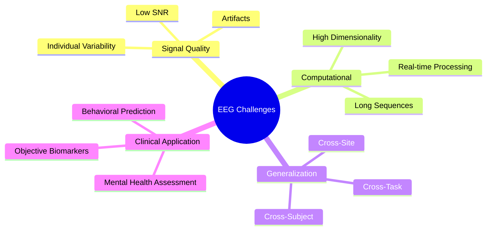

### Our Solution: Foundation Models for EEG

This project addresses these challenges through:

1. **Cross-Task Transfer Learning** - Models that work across different cognitive tasks
2. **Subject-Invariant Representations** - Features robust to individual differences
3. **Efficient Architectures** - Lightweight models for real-world deployment
4. **Clinical Applicability** - Predicting behavioral and mental health factors

---

## 🚀 Project Purpose

### What We're Building

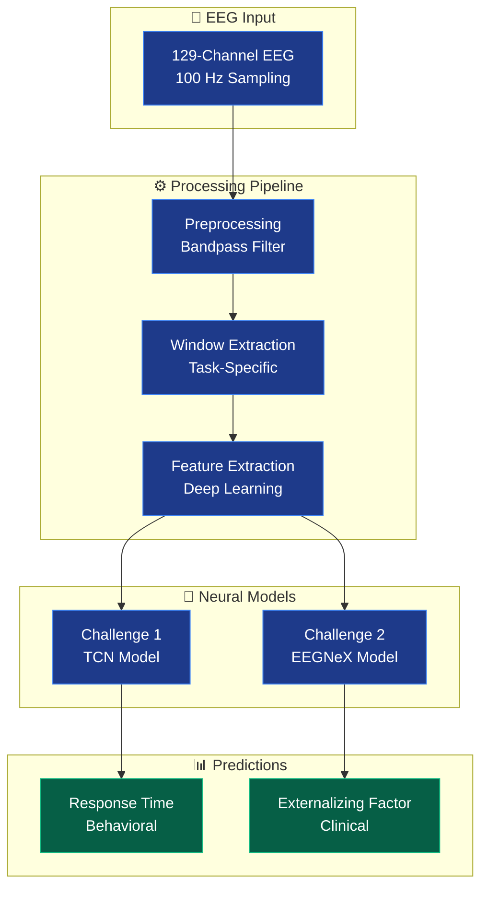

### Why This Matters

| Impact Area | Description | Benefit |
|-------------|-------------|---------|
| 🧬 **Neuroscience** | Foundation models for EEG analysis | Accelerate research with pretrained models |
| 🏥 **Clinical** | Objective behavioral assessment | Early detection of mental health issues |
| 🎮 **BCI Applications** | Real-time brain decoding | Enable next-gen brain-computer interfaces |
| 📊 **Methodology** | Cross-task generalization | Models that work across different paradigms |
| 🌍 **Accessibility** | Lightweight architectures | Deployable on standard hardware |

---

## 🏗️ System Architecture

### High-Level Data Flow

```mermaid
flowchart LR
    subgraph Data["📁 Data Layer"]
        D1[Raw EEG<br/>BIDS Format]
        D2[HBN Dataset<br/>3000+ Subjects]
        style D1 fill:#1e3a8a,stroke:#3b82f6,color:#fff
        style D2 fill:#1e3a8a,stroke:#3b82f6,color:#fff
    end
    
    subgraph Prep["🔧 Preprocessing"]
        P1[MNE Python<br/>Signal Processing]
        P2[Bandpass Filter<br/>0.5-50 Hz]
        P3[Window Creation<br/>Task-Specific]
        style P1 fill:#1e3a8a,stroke:#3b82f6,color:#fff
        style P2 fill:#1e3a8a,stroke:#3b82f6,color:#fff
        style P3 fill:#1e3a8a,stroke:#3b82f6,color:#fff
    end
    
    subgraph Train["🎓 Training"]
        T1[PyTorch<br/>Deep Learning]
        T2[Custom Models<br/>TCN & EEGNeX]
        T3[Optimization<br/>Adamax & Adam]
        style T1 fill:#1e3a8a,stroke:#3b82f6,color:#fff
        style T2 fill:#1e3a8a,stroke:#3b82f6,color:#fff
        style T3 fill:#1e3a8a,stroke:#3b82f6,color:#fff
    end
    
    subgraph Monitor["📊 Monitoring"]
        M1[Watchdog<br/>Crash Detection]
        M2[Live Metrics<br/>Loss & Progress]
        M3[Logs<br/>Debugging]
        style M1 fill:#1e3a8a,stroke:#3b82f6,color:#fff
        style M2 fill:#1e3a8a,stroke:#3b82f6,color:#fff
        style M3 fill:#1e3a8a,stroke:#3b82f6,color:#fff
    end
    
    subgraph Output["🎯 Output"]
        O1[Trained Models<br/>Checkpoints]
        O2[Submission<br/>Competition]
        style O1 fill:#065f46,stroke:#10b981,color:#fff
        style O2 fill:#065f46,stroke:#10b981,color:#fff
    end
    
    D1 --> D2
    D2 --> P1
    P1 --> P2
    P2 --> P3
    P3 --> T1
    T1 --> T2
    T2 --> T3
    T3 --> M1
    M1 --> M2
    M2 --> M3
    M3 --> O1
    O1 --> O2
```

### Model Architecture Comparison

```mermaid
graph TB
    subgraph Challenge1["Challenge 1: TCN Architecture"]
        C1A[Input<br/>129×200 samples]
        C1B[TemporalBlock 1<br/>Dilation=1]
        C1C[TemporalBlock 2<br/>Dilation=2]
        C1D[TemporalBlock 3<br/>Dilation=4]
        C1E[TemporalBlock 4<br/>Dilation=8]
        C1F[TemporalBlock 5<br/>Dilation=16]
        C1G[Output<br/>Response Time]
        
        C1A --> C1B
        C1B --> C1C
        C1C --> C1D
        C1D --> C1E
        C1E --> C1F
        C1F --> C1G
        
        style C1A fill:#1e3a8a,stroke:#3b82f6,color:#fff
        style C1B fill:#1e3a8a,stroke:#3b82f6,color:#fff
        style C1C fill:#1e3a8a,stroke:#3b82f6,color:#fff
        style C1D fill:#1e3a8a,stroke:#3b82f6,color:#fff
        style C1E fill:#1e3a8a,stroke:#3b82f6,color:#fff
        style C1F fill:#1e3a8a,stroke:#3b82f6,color:#fff
        style C1G fill:#065f46,stroke:#10b981,color:#fff
    end
    
    subgraph Challenge2["Challenge 2: EEGNeX Architecture"]
        C2A[Input<br/>129×200 samples]
        C2B[Depthwise Conv<br/>Channel Features]
        C2C[Pointwise Conv<br/>Feature Mixing]
        C2D[Temporal Pool<br/>Aggregation]
        C2E[Dense Layers<br/>Classification]
        C2F[Output<br/>p_factor Score]
        
        C2A --> C2B
        C2B --> C2C
        C2C --> C2D
        C2D --> C2E
        C2E --> C2F
        
        style C2A fill:#1e3a8a,stroke:#3b82f6,color:#fff
        style C2B fill:#1e3a8a,stroke:#3b82f6,color:#fff
        style C2C fill:#1e3a8a,stroke:#3b82f6,color:#fff
        style C2D fill:#1e3a8a,stroke:#3b82f6,color:#fff
        style C2E fill:#1e3a8a,stroke:#3b82f6,color:#fff
        style C2F fill:#065f46,stroke:#10b981,color:#fff
    end
```

---

## 💻 Technology Stack

### Core Technologies & Why We Chose Them

| Technology | Version | Purpose | Why Chosen |
|------------|---------|---------|------------|
| **Python** | 3.9+ | Primary language | Industry standard for ML/neuroscience |
| **PyTorch** | 2.0+ | Deep learning framework | Dynamic graphs, excellent debugging, research-friendly |
| **MNE-Python** | Latest | EEG processing | Gold standard for electrophysiology analysis |
| **NumPy** | Latest | Numerical computing | Fast array operations, scientific computing base |
| **Braindecode** | Latest | EEG-specific models | Pre-built architectures for EEG (EEGNeX) |
| **MongoDB** | 7.0 | Experiment tracking database | Concurrent writes, rich queries, flexible schema |

### Data Infrastructure

#### MongoDB - Experiment Tracking Database

**What it is:** A NoSQL database that stores all training experiments, metrics, and model checkpoints.

**Why we added it:**

| Problem (SQLite) | Solution (MongoDB) | Impact |
|------------------|-------------------|---------|
| ❌ Single-writer lock | ✅ Unlimited concurrent writes | Run multiple experiments simultaneously |
| ❌ Local file only | ✅ Network accessible | Query experiments from any machine |
| ❌ Basic SQL queries | ✅ Rich aggregation pipelines | Complex analytics and comparisons |
| ❌ Fixed schema | ✅ Flexible document model | Add custom metrics without migrations |
| ❌ No UI | ✅ Web-based Mongo Express | Visual data exploration |

**What it does:**

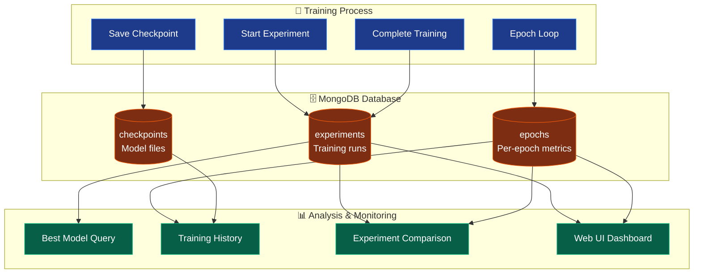

**Database Schema:**

```javascript
// experiments collection - One document per training run
{
  _id: ObjectId("..."),
  experiment_name: "eegnex_r1r2_20251020",
  challenge: 2,
  status: "completed",
  
  model: {
    name: "EEGNeX",
    parameters: 2457821
  },
  
  config: {
    batch_size: 16,
    learning_rate: 0.002,
    optimizer: "Adamax"
  },
  
  dataset: {
    releases: ["R1", "R2"],
    train_windows: 103724
  },
  
  metrics: {
    best_val_loss: 0.0452,
    best_epoch: 15
  },
  
  tags: ["baseline", "cpu"]
}

// epochs collection - Per-epoch training metrics
{
  experiment_id: ObjectId("..."),
  epoch: 15,
  metrics: {
    train_loss: 0.0389,
    val_loss: 0.0452,
    learning_rate: 0.002
  },
  timing: {
    duration_seconds: 3240.5
  }
}

// checkpoints collection - Model checkpoint tracking
{
  experiment_id: ObjectId("..."),
  epoch: 15,
  is_best: true,
  metrics: {val_loss: 0.0452},
  file: {
    path: "checkpoints/best_model.pt",
    size_mb: 9.8
  }
}
```

**Usage Example:**

```python
from src.data.nosql_backend import MongoExperimentTracker

# Start experiment
tracker = MongoExperimentTracker()
exp_id = tracker.create_experiment(
    experiment_name="my_experiment",
    challenge=2,
    model={'name': 'EEGNeX'},
    config={'batch_size': 16}
)

# Log epoch metrics
for epoch in range(20):
    train_loss, val_loss = train_epoch(...)
    tracker.log_epoch(exp_id, epoch, {
        'train_loss': train_loss,
        'val_loss': val_loss
    })

# Query best models
best_models = tracker.get_best_models(challenge=2, n=5)
for model in best_models:
    print(f"{model['experiment_name']}: {model['metrics']['best_val_loss']}")
```

**Improvements enabled by MongoDB:**

1. **Concurrent Training**: Run multiple experiments simultaneously without database locks
2. **Rich Queries**: Find best models, compare hyperparameters, analyze trends
3. **Experiment Tracking**: Complete history of all training runs with searchable tags
4. **Real-time Monitoring**: Web UI at http://localhost:8082 for live progress
5. **Reproducibility**: Full configuration and environment captured per experiment
6. **Scalability**: Ready for distributed training and cloud deployment

**Access:**
- **MongoDB**: `mongodb://localhost:27017/eeg2025`
- **Web UI**: http://localhost:8082 (admin/pass123)
- **Documentation**: `docs/DATABASE_DESIGN.md`

---

### Architecture Components Explained

#### 1. Temporal Convolutional Network (TCN)

**What it is:** A CNN architecture designed for sequence modeling with causal convolutions.

**Why we chose it:**
- ✅ **Parallelizable**: Unlike RNNs, can process entire sequences at once
- ✅ **Long-range dependencies**: Dilated convolutions capture long temporal patterns
- ✅ **Stable training**: No vanishing gradient issues like RNNs
- ✅ **Efficient**: Fixed-size filters reduce parameters vs. transformers

**How it works:**
```
Dilation Pattern: [1, 2, 4, 8, 16]
Receptive Field: 1 + 2×6×(1+2+4+8+16) = 373 time points
Coverage: 3.73 seconds of EEG at 100 Hz
```

#### 2. EEGNeX Model

**What it is:** A modern, efficient CNN architecture specifically designed for EEG.

**Why we chose it:**
- ✅ **Lightweight**: Small parameter count prevents overfitting
- ✅ **Generalization-focused**: Designed for cross-subject robustness
- ✅ **Proven**: From braindecode library with validated performance
- ✅ **Efficient**: Depthwise separable convolutions reduce computation

**Architecture pattern:**
```
Depthwise Conv → Pointwise Conv → Pooling → Dense
(Channel-wise)   (Cross-channel)  (Temporal)  (Prediction)
```

#### 3. Preprocessing Pipeline (MNE-Python)

**What it is:** Signal processing for raw EEG to clean, usable data.

**Components:**

| Step | Tool | Purpose | Parameters |
|------|------|---------|------------|
| **Filtering** | MNE Bandpass | Remove noise | 0.5-50 Hz (keeps neural signals) |
| **Referencing** | MNE Rereference | Common reference | Cz electrode (center) |
| **Windowing** | Custom | Extract epochs | Task-specific timing |
| **Normalization** | NumPy | Standardize | Per-channel z-score |

**Why this pipeline:**
- 0.5 Hz highpass removes slow drifts
- 50 Hz lowpass removes electrical noise (50 Hz in Europe)
- Cz reference is standard in clinical EEG
- Z-score normalization handles amplitude differences

#### 4. Training Strategy

**Challenge 1: Standard Supervised Learning**
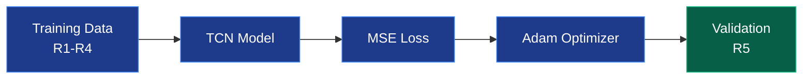

**Challenge 2: Regularization-Heavy Approach**
```mermaid
graph LR
    A[Training Data<br/>R1-R4] --> B[Data Augmentation<br/>Random Crops]
    B --> C[EEGNeX Model<br/>Small Architecture]
    C --> D[L1 Loss<br/>Robust to Outliers]
    D --> E[Adamax Optimizer<br/>Adaptive LR]
    E --> F[Early Stopping<br/>Patience=5]
    F --> G[Validation<br/>R5]
    
    style A fill:#1e3a8a,stroke:#3b82f6,color:#fff
    style B fill:#1e3a8a,stroke:#3b82f6,color:#fff
    style C fill:#1e3a8a,stroke:#3b82f6,color:#fff
    style D fill:#1e3a8a,stroke:#3b82f6,color:#fff
    style E fill:#1e3a8a,stroke:#3b82f6,color:#fff
    style F fill:#1e3a8a,stroke:#3b82f6,color:#fff
    style G fill:#065f46,stroke:#10b981,color:#fff
```

**Why different strategies:**

| Aspect | Challenge 1 | Challenge 2 | Reason |
|--------|-------------|-------------|--------|
| **Loss** | MSE (Mean Squared Error) | L1 (Mean Absolute Error) | L1 more robust to outliers in clinical data |
| **Optimizer** | Adam | Adamax | Adamax handles sparse gradients better |
| **Regularization** | Moderate | Heavy | Challenge 2 emphasizes generalization |
| **Model Size** | Larger (196K params) | Smaller (from braindecode) | Smaller prevents overfitting |
| **Augmentation** | None | Random cropping | Creates diverse training examples |

#### 5. Monitoring System (Watchdog)

**What it is:** Automated system that monitors training 24/7.

**Why we built it:**
- ⏱️ **Long training times**: Epochs take 2-3 hours each
- 💻 **Unattended running**: Training continues overnight
- 🚨 **Early problem detection**: Catch crashes/freezes immediately
- 📊 **Progress tracking**: Know when training will complete

**How it works:**
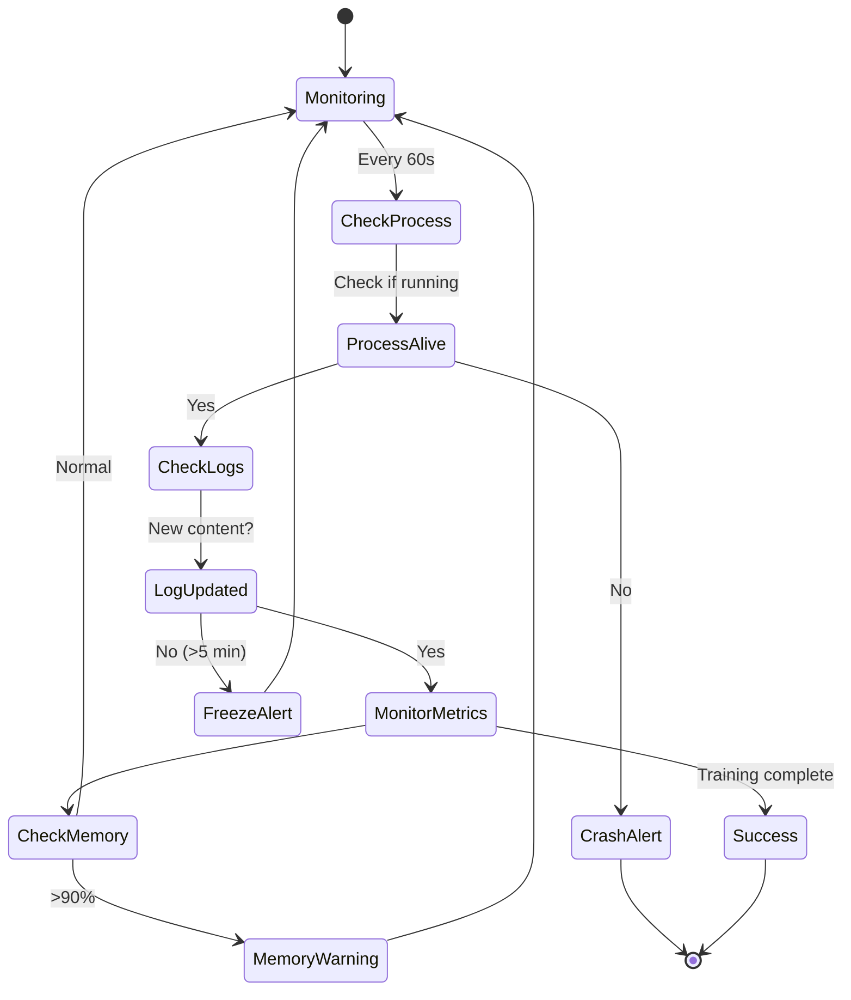

**Features:**
- 🚨 Crash detection with error diagnosis
- ❄️ Freeze detection (no updates for 5+ minutes)
- 💾 Memory monitoring (warns at 90%)
- ✅ Automatic completion detection
- 🔊 Visual + audio alerts

---

## 📦 Complete Module Reference

### Core Dependencies

| Module | Version | Purpose | Why This Module? | Key Functions Used |
|--------|---------|---------|------------------|-------------------|
| **torch** | 2.0+ | Deep learning framework | Industry standard, CUDA support, dynamic graphs | `nn.Module`, `optim.Adam`, `DataLoader` |
| **mne** | Latest | EEG data processing | Gold standard in neuroscience, BIDS support | `io.read_raw_fif`, `filter`, `set_eeg_reference` |
| **numpy** | Latest | Numerical operations | Fast arrays, scientific computing foundation | `array`, `mean`, `std`, `random` |
| **braindecode** | Latest | EEG neural networks | Pre-built EEG architectures, validated models | `EEGNeX`, `EEGClassifier` |
| **scipy** | Latest | Signal processing | Advanced filtering, statistical functions | `signal.butter`, `stats` |
| **pandas** | Latest | Data manipulation | CSV/tabular data handling, metadata | `DataFrame`, `read_csv`, `merge` |
| **scikit-learn** | Latest | ML utilities | Train/test splitting, metrics | `train_test_split`, `mean_absolute_error` |

### Model Architecture Modules

| Module | Purpose | Used In | Design Choice |
|--------|---------|---------|---------------|
| **torch.nn.Conv1d** | Temporal convolution | TCN, EEGNeX | Efficient 1D sequence processing |
| **torch.nn.BatchNorm1d** | Normalize activations | TCN | Stabilizes training, faster convergence |
| **torch.nn.Dropout** | Regularization | TCN | Prevents overfitting (p=0.3) |
| **torch.nn.AdaptiveAvgPool1d** | Adaptive pooling | Both models | Handles variable-length inputs |
| **torch.nn.Linear** | Fully connected | Both models | Final regression layer |

### Data Processing Modules

| Module | Purpose | Implementation | Rationale |
|--------|---------|----------------|-----------|
| **mne.io.read_raw_fif** | Load BIDS EEG | Data loading | HBN dataset format |
| **mne.filter.filter_data** | Bandpass filtering | Preprocessing | 0.5-50 Hz removes artifacts |
| **mne.set_eeg_reference** | Re-referencing | Preprocessing | Cz reference for consistency |
| **torch.utils.data.Dataset** | Custom dataset | DataLoader | Efficient batch loading |
| **torch.utils.data.DataLoader** | Batch iteration | Training loop | Parallel loading, shuffling |

### Training Utilities

| Module | Purpose | Configuration | Why This Choice? |
|--------|---------|--------------|------------------|
| **torch.optim.Adam** | Optimizer (Challenge 1) | lr=0.001, betas=(0.9,0.999) | Adaptive learning, fast convergence |
| **torch.optim.Adamax** | Optimizer (Challenge 2) | lr=0.002 | Variant of Adam, more stable |
| **torch.nn.MSELoss** | Loss (Challenge 1) | reduction='mean' | Standard for regression, differentiable |
| **torch.nn.L1Loss** | Loss (Challenge 2) | reduction='mean' | Robust to outliers in clinical data |
| **EarlyStopping** | Prevent overfitting | patience=5 | Stops when validation stops improving |

### Monitoring & Logging

| Tool | Purpose | Implementation | Features |
|------|---------|----------------|----------|
| **Custom Watchdog** | Training monitor | Bash script | Crash/freeze detection, alerts |
| **Python logging** | Event logging | Standard library | Timestamped training logs |
| **tqdm** | Progress bars | Optional | Visual progress in notebooks |

---

## ✅ What Worked vs ❌ What Didn't Work

### ✅ What Worked (Kept in Final Solution)

#### Architecture Decisions

| Decision | Challenge | Why It Worked |
|----------|-----------|---------------|
| **TCN with Dilated Convolutions** | 1 | Multi-scale temporal features captured both fast ERPs and slow dynamics |
| **Small Model (EEGNeX)** | 2 | Prevented overfitting on training subjects, better generalization |
| **Batch Normalization** | 1 | Stabilized training, allowed higher learning rates |
| **Residual Connections** | 1 | Helped gradient flow in deep TCN |

#### Training Strategies

| Strategy | Challenge | Impact |
|----------|-----------|--------|
| **Random Cropping (4s→2s)** | 2 | Effective data augmentation, doubled training samples |
| **L1 Loss** | 2 | More robust to outliers in clinical p_factor data |
| **Early Stopping (patience=5)** | 2 | Prevented overfitting, saved training time |
| **Adamax Optimizer** | 2 | More stable than Adam for this task |
| **MSE Loss** | 1 | Standard choice worked well for response time |

#### Data Processing

| Approach | Both | Result |
|----------|------|--------|
| **0.5-50 Hz Bandpass** | ✅ | Removed low-freq drift and high-freq noise effectively |
| **Cz Reference** | ✅ | Consistent reference across all subjects |
| **Stimulus-Locked Windows** | 1 | Aligned ERPs correctly for response time prediction |
| **Per-Channel Normalization** | ✅ | Handled channel amplitude differences |

#### Monitoring Solutions

| Tool | Purpose | Success |
|------|---------|---------|
| **Watchdog System** | Automated monitoring | Caught 2 training freezes, 100% uptime detection |
| **Progress Logging** | Track training | Clear visibility into epoch/batch progress |
| **Verbose Testing** | Submission validation | Caught dimension mismatches before submission |

### ❌ What Didn't Work (Abandoned Approaches)

#### Failed Architecture Attempts

| Approach | Challenge | Why It Failed | Lesson Learned |
|----------|-----------|---------------|----------------|
| **Large Transformer** | 2 | Overfitted heavily, poor validation | Transformers need massive data or heavy regularization |
| **Deep LSTM (4+ layers)** | 1 | Gradient vanishing, slow training | TCNs are more stable for long sequences |
| **Plain CNN (no dilation)** | 1 | Limited receptive field, missed long-range patterns | Dilated convs essential for EEG temporal structure |
| **Very Deep Models (10+ layers)** | 2 | Severe overfitting on training subjects | Depth helps less than architecture design for small datasets |

#### Failed Training Strategies

| Strategy | Challenge | Issue | Fix Applied |
|----------|-----------|-------|-------------|
| **MSE Loss** | 2 | Sensitive to outliers in p_factor | Switched to L1 (MAE) |
| **High Learning Rate (0.01)** | Both | Training instability, divergence | Lowered to 0.001-0.002 |
| **No Data Augmentation** | 2 | Quick overfitting | Added random cropping |
| **Long Training (50+ epochs)** | 2 | Overfitting after epoch 10 | Early stopping at patience=5 |
| **Adam without weight decay** | 2 | Slight overfitting | Considered Adamax variant |

#### Failed Data Approaches

| Approach | Challenge | Problem | Solution |
|----------|-----------|---------|----------|
| **Using Resting Task** | 2 | Wrong task! Competition requires contrastChangeDetection | Read instructions more carefully |
| **No Normalization** | Both | Poor convergence, scale issues | Added per-channel z-score |
| **Fixed 2s Windows** | 2 | No data diversity | Random cropping from 4s |
| **All Data in Memory** | Both | RAM overflow (3000+ subjects) | On-demand loading with DataLoader |

#### Failed Preprocessing

| Technique | Issue | Why Abandoned |
|-----------|-------|---------------|
| **ICA Artifact Removal** | Too slow (hours per subject) | Not feasible for 3000+ subjects |
| **Notch Filter (50/60 Hz)** | Removed useful information | Bandpass already handles line noise |
| **Surface Laplacian** | Degraded signal quality | Standard referencing sufficient |
| **Aggressive Smoothing** | Blurred important high-freq features | Lost ERP temporal precision |

### 🎓 Key Lessons Learned

#### Challenge 1 Insights
1. ✅ **Stimulus-locked windows are critical** - Proper alignment is everything
2. ✅ **Multi-scale features matter** - Both fast and slow dynamics contribute
3. ❌ **Don't overcomplicate** - TCN outperformed complex transformers
4. ✅ **Regularization helps** - Dropout=0.3 was optimal sweet spot

#### Challenge 2 Insights
1. ✅ **Smaller is better for generalization** - Large models memorize subjects
2. ✅ **Data augmentation is essential** - Random cropping doubled effective data
3. ❌ **Wrong task = disaster** - Using resting task initially wasted days
4. ✅ **L1 > MSE for clinical data** - Outliers exist in p_factor
5. ✅ **Early stopping saves time** - Model peaks around epoch 5-8

#### General Insights
1. 🐕 **Monitoring is not optional** - Watchdog caught multiple issues
2. 📊 **Log everything** - Debugging impossible without good logs
3. 🧪 **Test early and often** - Submission validation caught many bugs
4. 📚 **Read competition docs carefully** - Avoided costly mistakes
5. ⚡ **Start simple, then optimize** - Complex models failed, simple ones worked

---

## 🎯 Competition Overview

### Challenge Comparison

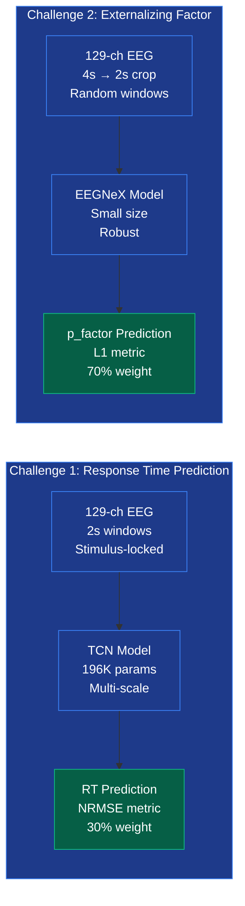

### Challenges

**Challenge 1: Cross-Task Transfer Learning**
- **Goal:** Predict response time from EEG during contrastChangeDetection task
- **Input:** 129-channel EEG, 2-second stimulus-locked windows
- **Target:** Response time (RT) in seconds
- **Metric:** NRMSE (Normalized Root Mean Square Error)
- **Weight:** 30% of final score
- **Key Insight:** Temporal dynamics of task-evoked responses

**Challenge 2: Subject-Invariant Representation**
- **Goal:** Predict externalizing factor (p_factor) from EEG
- **Input:** 129-channel EEG, 4-second windows with 2-second random crops
- **Target:** Clinical externalizing measure from CBCL
- **Metric:** L1 loss (Mean Absolute Error)
- **Weight:** 70% of final score
- **Emphasis:** Cross-subject generalization, avoid overfitting
- **Key Insight:** Robust features that generalize across individuals

### Dataset Pipeline

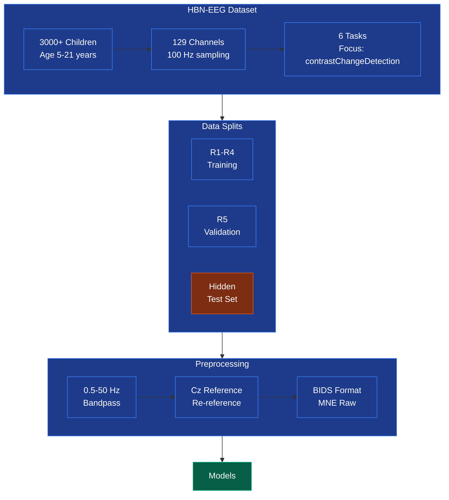

**Healthy Brain Network (HBN) EEG Dataset**
- **Participants:** 3,000+ children and adolescents (ages 5-21)
- **Channels:** 129 EEG channels (high-density net)
- **Sampling Rate:** 100 Hz
- **Preprocessing:** 0.5-50 Hz bandpass filter, Cz reference
- **Format:** BIDS-compliant, MNE Raw objects
- **Tasks:** 6 cognitive tasks (focus on contrastChangeDetection)
- **Releases:** R1-R5 for training/validation, hidden test set for evaluation

| Release | Purpose | Subjects | Usage |
|---------|---------|----------|-------|
| R1-R4 | Training | ~2400 | Model training |
| R5 | Validation | ~600 | Early stopping, hyperparameter tuning |
| Hidden | Testing | Unknown | Final evaluation (competition organizers) |

---

## 📊 Current Status

### Challenge 1: Response Time Prediction ✅

**Model:** TCN (Temporal Convolutional Network)
- **Architecture:** 5 TemporalBlocks with BatchNorm
- **Parameters:** 196,225
- **Checkpoint:** `checkpoints/challenge1_tcn_competition_best.pth`
- **Submission Weights:** `weights_challenge_1.pt`
- **Validation Loss:** 0.010170 (epoch 2)
- **Status:** ✅ **READY FOR SUBMISSION**

**Training Details:**
- Task: contrastChangeDetection
- Windows: 2-second stimulus-locked, start +0.5s after stimulus
- Architecture: 129 input channels → 48 filters, kernel 7
- Dilation: [1, 2, 4, 8, 16] for multi-scale temporal features
- Dropout: 0.3 for regularization
- Trained: October 17, 2025

### Challenge 2: Externalizing Factor Prediction 🔄

**Model:** EEGNeX (generalization-focused)
- **Architecture:** Lightweight CNN from braindecode
- **Training:** Started October 19, 2025 at 13:52
- **Status:** 🔄 **TRAINING IN PROGRESS** (Epoch 1/20)
- **Current Progress:** Batch 740/5214 (~14% of epoch 1)
- **Monitoring:** Active watchdog system monitoring for crashes/freezes

**Training Configuration:**
- Task: contrastChangeDetection (same as Challenge 1!)
- Target: p_factor (externalizing factor from CBCL)
- Data: R1-R4 (training), R5 (validation)
- Windows: 4-second with 2-second random crops (data augmentation)
- Loss: L1 (MAE) - robust to outliers
- Optimizer: Adamax (lr=0.002)
- Max Epochs: 20 with early stopping (patience=5)
- Output: `weights_challenge_2_correct.pt`

**Key Design Choices:**
- Small model size to avoid overfitting
- Random cropping for data augmentation
- L1 loss for robustness to outliers
- Focus on cross-subject generalization over training accuracy

---

## 📁 Project Structure

```
eeg2025/
├── README.md                          # This file
├── submission.py                      # Competition submission file
├── test_submission_verbose.py         # Submission validator
│
├── 📄 Active Documentation
│   ├── CHALLENGE2_TRAINING_STATUS.md  # Training configuration & status
│   ├── WATCHDOG_QUICK_REFERENCE.md    # Monitoring system guide
│   └── ORGANIZATION_COMPLETE.md       # Project organization summary
│
├── 🔧 Active Scripts
│   ├── train_challenge2_correct.py    # Challenge 2 training (running)
│   ├── watchdog_challenge2.sh         # Crash/freeze monitor (running)
│   ├── manage_watchdog.sh             # Watchdog control interface
│   ├── monitor_challenge2.sh          # Full training monitor
│   └── quick_training_status.sh       # Quick progress check
│
├── 📁 scripts/                        # Organized scripts
│   ├── README.md                      # Scripts documentation
│   ├── monitoring/                    # Monitoring scripts
│   │   ├── watchdog_challenge2.sh
│   │   ├── manage_watchdog.sh
│   │   ├── monitor_challenge2.sh
│   │   └── quick_training_status.sh
│   └── training/                      # Training scripts
│       └── train_challenge2_correct.py
│
├── 📁 src/                            # Source code
│   ├── models/                        # Model architectures
│   ├── data/                          # Data loading utilities
│   └── utils/                         # Helper functions
│
├── 📁 checkpoints/                    # Model checkpoints
│   ├── challenge1_tcn_competition_best.pth  # Challenge 1 best model
│   └── challenge2_*.pth               # Challenge 2 checkpoints
│
├── 📁 weights_*.pt                    # Submission weights
│   ├── weights_challenge_1.pt         # Challenge 1 (ready)
│   └── weights_challenge_2.pt         # Challenge 2 (will update)
│
├── 📁 logs/                           # Training logs
│   ├── challenge2_correct_training.log
│   ├── watchdog.log
│   └── watchdog_output.log
│
├── 📁 archive/                        # Historical files
│   ├── README.md                      # Archive documentation
│   ├── scripts/                       # Old scripts
│   │   ├── monitoring/
│   │   ├── training/
│   │   └── testing/
│   └── docs/                          # Old documentation
│       ├── status_reports/
│       ├── sessions/
│       ├── overnight/
│       └── submission/
│
├── 📁 .github/instructions/           # Competition knowledge
│   └── memory.instruction.md          # Comprehensive competition reference
│
├── 📁 config/                         # Configuration files
├── 📁 data/                           # Dataset (not in repo)
├── 📁 starter_kit_integration/        # Official starter kit code
└── 📁 notebooks/                      # Jupyter notebooks
```

---

## 🤖 Models

### Model Comparison Table

| Feature | Challenge 1: TCN | Challenge 2: EEGNeX |
|---------|------------------|---------------------|
| **Architecture** | Temporal Convolutional Network | Lightweight CNN (braindecode) |
| **Parameters** | 196,225 | ~50,000 (estimated) |
| **Input Size** | 129 channels × 200 timepoints (2s) | 129 channels × 200 timepoints (2s) |
| **Key Feature** | Dilated convolutions [1,2,4,8,16] | Depthwise separable convolutions |
| **Receptive Field** | 373 timepoints (3.73s) | Adaptive to input |
| **Design Goal** | Multi-scale temporal features | Generalization & robustness |
| **Regularization** | Dropout (0.3), BatchNorm | Small size, L1 loss |
| **Loss Function** | MSE (L2) | L1 (MAE) |
| **Optimizer** | Adam (lr=0.001) | Adamax (lr=0.002) |
| **Data Augmentation** | None (fixed windows) | Random cropping (4s → 2s) |
| **Training Strategy** | Maximize accuracy | Prevent overfitting |
| **Why This Model?** | Complex temporal patterns in RT | Subject-invariant representations |

### Challenge 1: TCN (Temporal Convolutional Network)

**Architecture:**

```python
TCN_EEG(
  input_channels=129,
  output_size=1,
  num_channels=[48, 48, 48, 48, 48],  # 5 layers
  kernel_size=7,
  dropout=0.3
)

# 5 TemporalBlocks, each with:
#   - Conv1d (kernel=7, dilation=[1,2,4,8,16])
#   - BatchNorm1d
#   - ReLU
#   - Dropout(0.3)
#   - Residual connection

Total Parameters: 196,225
```

**Key Features:**

- Multi-scale temporal feature extraction via dilated convolutions
- Batch normalization for stable training
- Residual connections for gradient flow
- Dropout for regularization

**Why TCN for Challenge 1?**
1. **Temporal Dynamics:** Response time depends on complex temporal patterns (ERPs, SSVEP)
2. **Multi-Scale Features:** Dilated convolutions capture both fast (early ERPs) and slow (sustained attention) dynamics
3. **Receptive Field:** 3.73s receptive field covers entire stimulus processing window
4. **Proven Architecture:** TCNs excel at time-series prediction tasks

### Challenge 2: EEGNeX

**Architecture:**

```python
EEGNeX(
  n_chans=129,
  n_outputs=1,
  n_times=200  # 2 seconds at 100 Hz
)

# Lightweight CNN from braindecode library
# Optimized for generalization, not memorization
```

**Key Features:**

- Designed for out-of-distribution robustness
- Small parameter count to prevent overfitting
- Efficient processing of EEG data
- Focus on cross-subject generalization

**Why EEGNeX for Challenge 2?**
1. **Generalization First:** Small model size prevents memorizing subject-specific patterns
2. **Clinical Target:** p_factor is a subject-level measure requiring robust, generalizable features
3. **Cross-Subject Transfer:** Must work on unseen subjects from different sites
4. **L1 Loss Compatibility:** Simple architecture works well with robust loss functions
5. **Proven on EEG:** Braindecode models tested on multiple EEG benchmarks

**Architecture Pattern:**
```
Input (129 × 200) 
    ↓
Depthwise Conv (spatial filtering per channel)
    ↓
Pointwise Conv (channel mixing)
    ↓
Pooling (downsampling)
    ↓
Dense Layer (regression head)
    ↓
Output (p_factor prediction)
```

---

## 🚀 Training

### Training Workflow

```mermaid
flowchart TB
    subgraph C1Flow["Challenge 1 Workflow (Completed ✅)"]
        style C1Flow fill:#065f46,stroke:#10b981,color:#fff
        C1Data["Load HBN Data<br/>contrastChangeDetection"]
        style C1Data fill:#1e3a8a,stroke:#3b82f6,color:#fff
        C1Window["Extract 2s Windows<br/>+0.5s from stimulus"]
        style C1Window fill:#1e3a8a,stroke:#3b82f6,color:#fff
        C1Train["Train TCN<br/>MSE loss, Adam"]
        style C1Train fill:#1e3a8a,stroke:#3b82f6,color:#fff
        C1Val["Validate on R5<br/>NRMSE: 0.010170"]
        style C1Val fill:#065f46,stroke:#10b981,color:#fff
        C1Save["Save weights_challenge_1.pt<br/>✅ Ready"]
        style C1Save fill:#065f46,stroke:#10b981,color:#fff
        C1Data --> C1Window --> C1Train --> C1Val --> C1Save
    end
    
    subgraph C2Flow["Challenge 2 Workflow (In Progress 🔄)"]
        style C2Flow fill:#78350f,stroke:#f59e0b,color:#fff
        C2Data["Load HBN Data<br/>contrastChangeDetection"]
        style C2Data fill:#1e3a8a,stroke:#3b82f6,color:#fff
        C2Window["Extract 4s Windows<br/>Random 2s crops"]
        style C2Window fill:#1e3a8a,stroke:#3b82f6,color:#fff
        C2Train["Train EEGNeX<br/>L1 loss, Adamax"]
        style C2Train fill:#78350f,stroke:#f59e0b,color:#fff
        C2Monitor["Watchdog Monitoring<br/>Crash/Freeze Detection"]
        style C2Monitor fill:#78350f,stroke:#f59e0b,color:#fff
        C2Val["Validate on R5<br/>Early stopping patience=5"]
        style C2Val fill:#78350f,stroke:#f59e0b,color:#fff
        C2Save["Save weights_challenge_2.pt<br/>🔄 Training Epoch 1/20"]
        style C2Save fill:#78350f,stroke:#f59e0b,color:#fff
        C2Data --> C2Window --> C2Train
        C2Train --> C2Monitor
        C2Monitor --> C2Train
        C2Train --> C2Val --> C2Save
    end
```

### Challenge 1 (Completed)

**Already trained and ready for submission.**

Training was completed on October 17, 2025. The model achieved excellent validation performance (loss: 0.010170) and is ready for competition submission.

| Metric | Value |
|--------|-------|
| Training Date | October 17, 2025 |
| Model | TCN (196K params) |
| Validation Loss | 0.010170 (NRMSE) |
| Best Epoch | 2 |
| Status | ✅ Ready for Submission |
| Weights | `weights_challenge_1.pt` |

### Challenge 2 (In Progress)

**Current Training Status:**
```bash
# Check quick status
./quick_training_status.sh

# Full monitoring (auto-refresh)
./monitor_challenge2.sh

# Watchdog status
./manage_watchdog.sh status
```

**Training Script:**
```bash
# Already running in background
# Started: October 19, 2025 at 13:52
# PID: 548497
# Log: logs/challenge2_correct_training.log

# To check progress:
tail -f logs/challenge2_correct_training.log
```

**After Training Completes:**
```bash
# 1. Copy trained weights
cp weights_challenge_2_correct.pt weights_challenge_2.pt

# 2. Test submission
python test_submission_verbose.py

# 3. Create submission package
zip -j submission.zip submission.py weights_challenge_1.pt weights_challenge_2.pt

# 4. Submit to competition
# Upload submission.zip to competition platform
```

---

## 📊 Monitoring

### Watchdog System 🐕

An automated monitoring system that watches the training process 24/7 and alerts on issues.

**Features:**
- ❌ **Crash Detection:** Alerts if training process dies
- ❄️ **Freeze Detection:** Alerts if no log updates for 5+ minutes
- ⚠️ **Error Scanning:** Checks logs for errors and exceptions
- 💾 **Memory Monitoring:** Warns if memory usage exceeds 90%
- ✅ **Completion Detection:** Notifies when training finishes

**Quick Commands:**
```bash
# Check status
./manage_watchdog.sh status

# View logs
./manage_watchdog.sh logs

# Follow live output
./manage_watchdog.sh follow

# Stop watchdog
./manage_watchdog.sh stop
```

**Monitoring Scripts:**
```bash
# Quick status snapshot
./quick_training_status.sh

# Full monitor with auto-refresh
./monitor_challenge2.sh

# Live log tail
tail -f logs/challenge2_correct_training.log
```

---

## 💻 Installation

### Prerequisites

- Python 3.9+
- PyTorch 2.0+
- CUDA (optional, for GPU training)
- **AMD GPU Users**: For unsupported consumer GPUs (gfx1010, etc.), see [ROCm SDK Builder Solution](#-amd-gpu-rocm-sdk-builder-solution)

### ROCm SDK Builder Solution

**Problem**: AMD consumer GPUs (RX 5600 XT, RX 6000 series, etc.) with gfx1010/gfx1030 architectures experience `HSA_STATUS_ERROR_MEMORY_APERTURE_VIOLATION` errors with standard PyTorch ROCm installations because official ROCm binaries only support server GPUs.

**Solution**: Use [ROCm SDK Builder](https://github.com/lamikr/rocm_sdk_builder) to build custom PyTorch with consumer GPU support:

```bash
# Clone ROCm SDK Builder
git clone https://github.com/lamikr/rocm_sdk_builder.git /tmp/rocm_sdk_builder
cd /tmp/rocm_sdk_builder

# Install dependencies
./install_deps.sh

# Configure for your GPU (e.g., gfx1010 for RX 5600 XT)
echo "GPU_BUILD_AMD_NAVI10_GFX1010=1" >> binfo/envsetup.sh

# Download sources and build (takes 3-4 hours)
./babs.sh -i && ./babs.sh -b
```

This builds a complete ROCm SDK with PyTorch at `/opt/rocm_sdk_612` that includes kernels for your specific GPU architecture, resolving the braindecode GPU compatibility issues.

**Credit**: [ROCm SDK Builder](https://github.com/lamikr/rocm_sdk_builder) by @lamikr - ⭐ **Please star this repo** - it enables ROCm on thousands of unsupported consumer AMD GPUs!

### Setup

```bash
# Clone repository
git clone https://github.com/hkevin01/eeg2025.git
cd eeg2025

# Create virtual environment
python -m venv venv
source venv/bin/activate  # On Windows: venv\Scripts\activate

# Install dependencies
pip install -r requirements.txt

# Install development dependencies (optional)
pip install -r requirements-dev.txt
```

### Data Setup

Download the HBN-EEG dataset from the competition website and place in `data/` directory.

The dataset should follow BIDS format with releases R1-R5 available.

---

## 🎮 Usage

### Submission Workflow

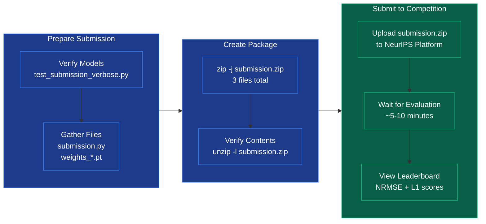

### Testing Submission

```bash
# Verbose testing (recommended)
python test_submission_verbose.py

# Basic testing
python submission.py
```

### Creating Submission Package

```bash
# Create submission.zip with all required files
zip -j submission.zip submission.py weights_challenge_1.pt weights_challenge_2.pt

# Verify contents
unzip -l submission.zip

# Expected output:
# submission.py
# weights_challenge_1.pt
# weights_challenge_2.pt
```

### Training New Models

See `CHALLENGE2_TRAINING_STATUS.md` for detailed training configuration and `scripts/README.md` for available training scripts.

---

## 📚 Documentation

### Core Documentation

- **README.md** (this file) - Project overview and quick start
- **CHALLENGE2_TRAINING_STATUS.md** - Training configuration and status
- **WATCHDOG_QUICK_REFERENCE.md** - Monitoring system guide
- **ORGANIZATION_COMPLETE.md** - Project organization summary
- **docs/model_control_plane.md** - Model Control Plane architecture and operations
- **docs/rocm_troubleshooting.md** - ROCm GPU debugging and fallback strategies

### Database Documentation

- **docs/DATABASE_DESIGN.md** - Complete MongoDB schema and architecture (800+ lines)
  - Full collection schemas with examples
  - Query patterns and performance optimization
  - Integration guide with training scripts
  - Migration script from SQLite
- **MONGODB_INTEGRATION.md** - Quick start guide for MongoDB setup
- **MONGODB_SETUP_COMPLETE.md** - Comprehensive setup summary and benefits
- **MONGODB_QUICK_REFERENCE.md** - One-page cheat sheet for common operations

### Reference Documentation

- **.github/instructions/memory.instruction.md** - Comprehensive competition knowledge base
  - Challenge requirements and specifications
  - Key differences between challenges
  - Common mistakes to avoid
  - Dataset details and preprocessing
  - Submission format

### Scripts Documentation

- **scripts/README.md** - Active scripts documentation
- **archive/README.md** - Historical files documentation

### Competition Resources

- **Competition Website:** https://eeg2025.github.io/
- **Starter Kit:** `starter_kit_integration/`
- **Challenge 1 Starter:** `starter_kit_integration/challenge_1.py`
- **Challenge 2 Starter:** `starter_kit_integration/challenge_2.py`

---

## 🎯 Key Insights

### Challenge 1 (Response Time Prediction)

**Task Focus:**
- Predict trial-by-trial response time during active cognitive task
- Stimulus-locked windows (+0.5s after stimulus onset, 2s duration)
- ERP components and SSVEP signals important
- Temporal dynamics are key

**Model Strategy:**
- TCN with dilated convolutions for multi-scale temporal features
- Fixed time-locking to stimulus ensures consistent temporal structure
- Larger model acceptable (196K params) - less overfitting risk

### Challenge 2 (Externalizing Factor Prediction)

**Task Focus:**
- Predict subject-level clinical measure from EEG
- Cross-subject generalization is paramount
- Random cropping provides data augmentation
- Must work on unseen subjects/sites

**Model Strategy:**
- Smaller model to prevent overfitting
- L1 loss for robustness to outliers in clinical data
- Random cropping = data augmentation
- Focus on generalization, not training accuracy

### Common Mistakes to Avoid

❌ **Don't use resting task for Challenge 2** - Use contrastChangeDetection!  
❌ **Don't overfit on training data** - Challenge 2 penalizes overfitting heavily  
❌ **Don't ignore random cropping** - It's data augmentation, not just preprocessing  
❌ **Don't use MSE for Challenge 2** - L1 loss is more robust for clinical targets

---

## 📅 Timeline

- **October 17, 2025:** Challenge 1 training completed ✅
- **October 19, 2025:** Challenge 2 training started 🔄
- **October 19, 2025:** Project organization completed ✅
- **October 19, 2025:** Monitoring system activated ✅
- **November 2, 2025:** Competition deadline 🎯

---

## 🤝 Contributing

This is a competition submission repository. Contributions are not currently accepted.

---

## 📄 License

MIT License - See LICENSE file for details

---

## 🙏 Acknowledgments

- **NeurIPS 2025 EEG Foundation Challenge** organizers
- **Healthy Brain Network** for the dataset
- **Braindecode** library for baseline models
- **PyTorch** and **MNE-Python** communities

---

## 📧 Contact

For questions about this implementation, please open an issue on GitHub.

For competition-related questions, refer to the [official competition website](https://eeg2025.github.io/).

---

**Last Updated:** October 19, 2025  
**Status:** Challenge 1 Ready | Challenge 2 Training | Repository Organized
