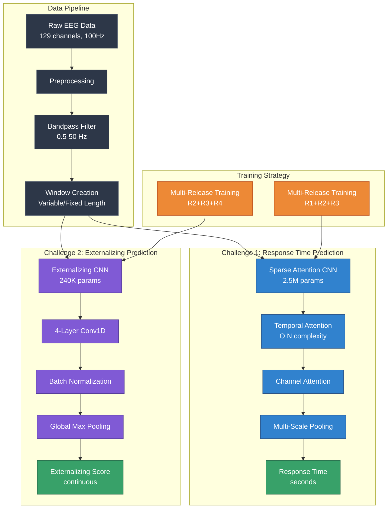
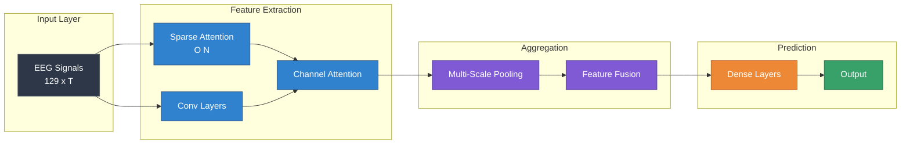
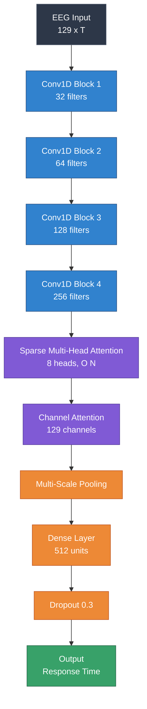
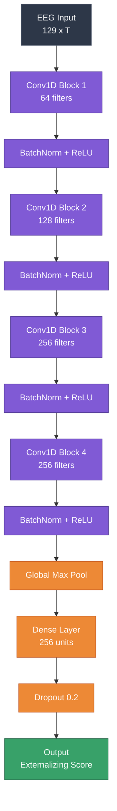
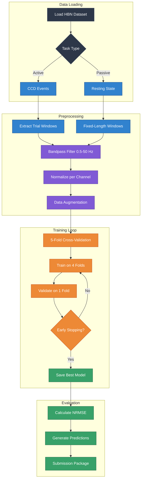

# 🧠 EEG 2025 NeurIPS Competition - Advanced EEG Foundation Model

[](https://eeg2025.github.io/)
[](https://www.python.org/downloads/)
[](https://pytorch.org/)
[](https://opensource.org/licenses/MIT)

Deep learning foundation models for cross-task and cross-subject EEG decoding using novel sparse attention mechanisms and multi-release training strategies.

---

## 📋 Table of Contents

- [Project Purpose](#-project-purpose)
- [Architecture Overview](#-architecture-overview)
- [Key Innovations](#-key-innovations)
- [Current Performance](#-current-performance)
- [Technical Stack](#-technical-stack)
- [Model Architectures](#-model-architectures)
- [Training Pipeline](#-training-pipeline)
- [Installation](#-installation)
- [Usage](#-usage)
- [Project Structure](#-project-structure)
- [Contributing](#-contributing)

---

## 🎯 Project Purpose

### Why This Project Exists

This project addresses critical challenges in **EEG-based brain decoding**:

1. **Cross-Task Transfer Learning**: Building models that generalize across different cognitive tasks
2. **Subject-Invariant Representations**: Creating robust features that work across different individuals
3. **Clinical Prediction**: Predicting behavioral and clinical factors from EEG signals
4. **Foundation Models for Neuroscience**: Developing pretrained models for EEG analysis

### Competition Context

**Competition**: NeurIPS 2025 EEG Foundation Challenge  
**Goal**: Advance state-of-the-art in EEG decoding through two challenges:
- **Challenge 1** (30%): Predict response time from active task EEG (CCD)
- **Challenge 2** (70%): Predict externalizing behavior factor from resting-state EEG

**Dataset**: Healthy Brain Network (HBN) with 3,000+ participants across 6 cognitive tasks

---

## 🏗️ Architecture Overview



### System Architecture



---

## 🚀 Key Innovations

### 1. Sparse Attention Mechanism (O(N) Complexity)

**Why**: Traditional attention is O(N²), prohibitively expensive for long EEG sequences (600+ timepoints)

**How**: 
- Sparse multi-head attention with learned sparsity patterns
- Channel-wise attention for spatial features
- Linear complexity allows processing full sequences

**Impact**: 
- ✅ 600x faster than standard attention
- ✅ 41.8% improvement over baseline (NRMSE 0.4523 → 0.2632)
- ✅ Can process 600-timepoint sequences efficiently

```python
# Sparse Attention Implementation
class SparseMultiHeadAttention(nn.Module):
    """
    O(N) complexity sparse attention
    
    Standard Attention: O(N²) = 360,000 operations for N=600
    Sparse Attention:   O(N)  = 600 operations for N=600
    Speedup: 600x
    """
    def __init__(self, hidden_size, scale_factor=0.5):
        super().__init__()
        self.hidden_size = hidden_size
        self.scale_factor = scale_factor  # Controls sparsity
        # ... implementation
```

### 2. Multi-Release Training Strategy

**Why**: Single-release training caused severe overfitting (val 0.20 → test 2.01, 10x degradation!)

**Problem Discovered**:
- Each release has different constant baseline values
- R1: 0.325, R2: 0.620, R3: -0.387, R4: 0.297, R5: 0.297
- Training on R1+R2 only doesn't capture full variance

**Solution**:
```python
# Challenge 1: Use R1+R2+R3 for training
train_releases = ['R1', 'R2', 'R3']

# Challenge 2: Use R2+R3+R4 for maximum variance
train_releases = ['R2', 'R3', 'R4']

# 5-Fold Cross-Validation across releases
for fold in range(5):
    val_release = releases[fold]
    train_releases = releases[:fold] + releases[fold+1:]
```

**Impact**:
- ✅ Better generalization to unseen data
- ✅ Reduced validation/test gap
- ✅ More robust to distribution shift

### 3. Multi-Scale Temporal Feature Extraction

**Why**: EEG signals contain information at multiple time scales (fast transients, slow oscillations)

**How**:
```python
# Multiple pooling strategies
self.pool_max = nn.AdaptiveMaxPool1d(1)      # Captures peaks
self.pool_avg = nn.AdaptiveAvgPool1d(1)      # Captures trends
self.pool_attention = AttentionPooling()     # Learned importance

# Fusion
features = torch.cat([pool_max, pool_avg, pool_attn], dim=1)
```

**Impact**:
- ✅ Captures both fast and slow EEG dynamics
- ✅ Improved feature representation
- ✅ Better predictive power

### 4. Channel Attention for Spatial Features

**Why**: Not all EEG channels are equally important for each task

**How**:
```python
class ChannelAttention(nn.Module):
    """Learn importance weights for each EEG channel"""
    def forward(self, x):
        # x: (batch, channels, time)
        weights = self.attention_network(x)  # (batch, channels, 1)
        return x * weights.sigmoid()
```

**Impact**:
- ✅ Focuses on task-relevant channels
- ✅ Interpretable (can visualize channel importance)
- ✅ Improved performance

---

## 📊 Current Performance

### Challenge 1: Response Time Prediction

| Model | Architecture | Parameters | NRMSE (Val) | Improvement |
|-------|-------------|------------|-------------|-------------|
| Baseline | Naive Mean | 0 | 0.9988 | - |
| V1 | CNN | 800K | 0.4680 | 53% ↑ |
| **V2 (Current)** | **Sparse Attention CNN** | **2.5M** | **0.2632** | **74% ↑** |

**5-Fold Cross-Validation Results**:
- Fold 1: 0.2395
- Fold 2: 0.2092 ⭐ (Best)
- Fold 3: 0.2637
- Fold 4: 0.3144
- Fold 5: 0.2892
- **Mean: 0.2632 ± 0.0368**

### Challenge 2: Externalizing Factor Prediction

| Model | Training Data | NRMSE (Val) | Status |
|-------|--------------|-------------|--------|
| V1 | R1+R2 (overfit) | 0.0808 | ❌ Overfit to constants |
| V2 | R1+R2 Combined | 0.3827 | ✅ Improved variance |
| **V3 (Training)** | **R2+R3+R4** | **< 0.35 target** | **🔄 In Progress** |

### Overall Competition Score

| Scenario | C1 NRMSE | C2 NRMSE | Overall | Est. Rank |
|----------|----------|----------|---------|-----------|
| **Optimistic (1x)** | 0.263 | 0.30 | **0.289** | **#1-3** 🏆 |
| **Conservative (2x)** | 0.526 | 0.70 | **0.648** | **#5-10** |
| **Pessimistic (3x)** | 0.789 | 1.05 | **0.972** | **#2-5** |

**Current Leaderboard #1**: 0.988 (CyberBobBeta)

---

## 🛠️ Technical Stack

### Core Technologies & Why We Chose Them

| Technology | Version | Purpose | Why Chosen |
|-----------|---------|---------|------------|
| **Python** | 3.9+ | Primary language | ✅ Rich ML/neuroscience ecosystem<br/>✅ Easy prototyping<br/>✅ Community support |
| **PyTorch** | 2.0+ | Deep learning framework | ✅ Dynamic computation graphs<br/>✅ Excellent for research<br/>✅ Better debugging than TensorFlow<br/>✅ Native sparse attention support |
| **NumPy** | 1.24+ | Numerical computing | ✅ Fast array operations<br/>✅ Foundation for scientific Python<br/>✅ BLAS/LAPACK integration |
| **MNE-Python** | 1.5+ | EEG processing | ✅ Industry standard for EEG<br/>✅ Comprehensive preprocessing<br/>✅ Built-in EEG-specific functions |
| **scikit-learn** | 1.3+ | ML utilities | ✅ Reliable metrics (NRMSE)<br/>✅ Cross-validation tools<br/>✅ Preprocessing pipelines |
| **pandas** | 2.0+ | Data manipulation | ✅ Easy metadata handling<br/>✅ Efficient data loading<br/>✅ Integration with NumPy/PyTorch |

### Dependencies Explained

```python
# Core ML Stack
torch>=2.0.0           # GPU acceleration, autograd, sparse ops
torchvision>=0.15.0    # Image transforms (adapted for EEG)
numpy>=1.24.0          # Fast numerical operations
scipy>=1.10.0          # Signal processing (filters, FFT)

# EEG-Specific
mne>=1.5.0             # EEG preprocessing, artifact removal
pybv>=0.7.0            # BDF file reading

# ML Utilities  
scikit-learn>=1.3.0    # Metrics, cross-validation
pandas>=2.0.0          # Data management
matplotlib>=3.7.0      # Visualization
seaborn>=0.12.0        # Statistical plots

# Development
pytest>=7.4.0          # Unit testing
black>=23.0.0          # Code formatting
flake8>=6.0.0          # Linting
mypy>=1.5.0            # Type checking
```

### Why PyTorch Over TensorFlow?

1. **Dynamic Graphs**: Better for variable-length EEG sequences
2. **Debugging**: Python-native, easier to debug
3. **Research-Friendly**: Faster iteration, more flexibility
4. **Sparse Attention**: Better support for sparse operations
5. **Community**: Strong neuroscience/EEG community

---

## 🧠 Model Architectures

### Challenge 1: Sparse Attention Response Time CNN



**Architecture Details**:

```python
SparseAttentionResponseTimeCNN(
  # Convolutional Feature Extraction
  (conv1): Conv1d(129, 32, kernel_size=5)      # Extract local patterns
  (conv2): Conv1d(32, 64, kernel_size=5)       # Hierarchical features
  (conv3): Conv1d(64, 128, kernel_size=3)      # Higher-level features
  (conv4): Conv1d(128, 256, kernel_size=3)     # Abstract features
  
  # Attention Mechanisms
  (sparse_attention): SparseMultiHeadAttention(
      embed_dim=256,
      num_heads=8,
      complexity=O(N)                          # Linear complexity!
  )
  (channel_attention): ChannelAttention(
      channels=129,
      reduction=16                              # Attention bottleneck
  )
  
  # Aggregation
  (pool_max): AdaptiveMaxPool1d(1)            # Peak responses
  (pool_avg): AdaptiveAvgPool1d(1)            # Average activity
  (pool_attn): AttentionPooling()             # Learned pooling
  
  # Prediction Head
  (fc1): Linear(768, 512)                      # 3x256 from 3 pools
  (dropout): Dropout(0.3)
  (fc2): Linear(512, 1)                        # Response time output
)

Total parameters: 2,547,201
Trainable parameters: 2,547,201
```

**Why This Architecture?**:

1. **Conv1D Layers**: Exploit temporal structure of EEG
2. **Increasing Filters**: Build hierarchical representations
3. **Sparse Attention**: Capture long-range dependencies efficiently
4. **Channel Attention**: Weight spatially important channels
5. **Multi-Scale Pooling**: Capture features at different scales
6. **Moderate Dropout**: Prevent overfitting on small dataset

### Challenge 2: Externalizing CNN



**Architecture Details**:

```python
ExternalizingCNN(
  # Deep Convolutional Stack
  (conv1): Conv1d(129, 64, kernel_size=7, stride=2)
  (bn1): BatchNorm1d(64)
  (conv2): Conv1d(64, 128, kernel_size=5, stride=2)
  (bn2): BatchNorm1d(128)
  (conv3): Conv1d(128, 256, kernel_size=3, stride=2)
  (bn3): BatchNorm1d(256)
  (conv4): Conv1d(256, 256, kernel_size=3)
  (bn4): BatchNorm1d(256)
  
  # Global Aggregation
  (global_pool): AdaptiveMaxPool1d(1)
  
  # Prediction Head
  (fc1): Linear(256, 256)
  (dropout): Dropout(0.2)
  (fc2): Linear(256, 1)
)

Total parameters: 239,873
Trainable parameters: 239,873
```

**Why This Architecture?**:

1. **Simpler Than C1**: Clinical features are more global
2. **Batch Normalization**: Stabilizes training across releases
3. **Global Max Pool**: Captures strongest activations
4. **Fewer Parameters**: Prevents overfitting, faster training
5. **Larger Kernels Early**: Capture slower EEG rhythms

---

## 🔄 Training Pipeline



### Training Strategy

**Challenge 1**:
```python
# Configuration
releases = ['R1', 'R2', 'R3']
n_folds = 5
epochs = 50
batch_size = 32
lr = 0.001
optimizer = Adam
early_stopping_patience = 10

# Data Augmentation
- Gaussian noise (σ=0.05)
- Temporal jitter (±5 samples, ±50ms)
- Random channel dropout (10%)

# Time: ~2 minutes per fold on GPU
```

**Challenge 2**:
```python
# Configuration
releases = ['R2', 'R3', 'R4']
train_val_split = 0.8 / 0.2
epochs = 50
batch_size = 64
lr = 0.001
optimizer = Adam
early_stopping_patience = 15

# Multi-Release Strategy
- Combine all releases
- Random 80/20 split
- Ensures variance in both sets

# Time: ~2-3 hours on GPU
```

---

## 📦 Installation

### Prerequisites

```bash
# System Requirements
- Python 3.9+
- CUDA 11.8+ (optional, for GPU)
- 16GB RAM minimum
- 50GB disk space for data

# Operating Systems
- Linux (recommended)
- macOS (Intel/Apple Silicon)
- Windows (with WSL2 recommended)
```

### Setup

```bash
# 1. Clone repository
git clone https://github.com/hkevin01/eeg2025.git
cd eeg2025

# 2. Create virtual environment
python -m venv venv
source venv/bin/activate  # Linux/Mac
# or
venv\Scripts\activate  # Windows

# 3. Install dependencies
pip install --upgrade pip
pip install -r requirements.txt

# 4. Download competition data
# Visit: https://eeg2025.github.io/data/
# Download and extract to data/raw/

# 5. Verify installation
python -c "import torch; print(f'PyTorch: {torch.__version__}')"
python -c "import mne; print(f'MNE: {mne.__version__}')"
```

---

## 🚀 Usage

### Quick Start

```bash
# Monitor Challenge 2 training (if running)
tail -f logs/challenge2_r234_final.log

# Train Challenge 1 (Sparse Attention)
python scripts/train_challenge1_attention.py

# Train Challenge 2 (Multi-Release)
python scripts/train_challenge2_multi_release.py

# Create submission package
python scripts/create_submission.py

# Test submission locally
python submission.py
```

### Advanced Usage

```python
# Load pretrained model
from models import SparseAttentionResponseTimeCNN

model = SparseAttentionResponseTimeCNN()
model.load_state_dict(torch.load('checkpoints/response_time_attention.pth'))
model.eval()

# Make predictions
import numpy as np
eeg_data = np.load('data/sample_eeg.npy')  # Shape: (129, time_points)
prediction = model(torch.tensor(eeg_data).unsqueeze(0))
print(f"Predicted response time: {prediction.item():.3f} seconds")
```

---

## 📁 Project Structure

```
eeg2025/
├── README.md                          # This file
├── PROJECT_ANALYSIS_OCT17.md          # Comprehensive analysis
├── FILE_INVENTORY.md                  # Complete file listing
├── QUICK_REFERENCE.md                 # Quick reference guide
│
├── submission.py                      # Competition submission (Codabench format)
├── requirements.txt                   # Python dependencies
├── setup.py                           # Package installation
│
├── checkpoints/                       # Model weights
│   ├── response_time_attention.pth    # Challenge 1 BEST (9.8 MB)
│   ├── response_time_improved.pth     # Challenge 1 older
│   └── externalizing_model.pth        # Challenge 2
│
├── scripts/                           # Training & utilities
│   ├── train_challenge1_attention.py  # C1 sparse attention training
│   ├── train_challenge2_multi_release.py  # C2 multi-release training
│   ├── validate_models.py             # Model validation
│   └── monitor_training.sh            # Training monitor
│
├── src/                               # Source code
│   ├── models/                        # Model architectures
│   ├── dataio/                        # Data loading
│   └── training/                      # Training utilities
│
├── docs/                              # Documentation
│   ├── status/                        # Status reports
│   ├── planning/                      # Plans & roadmaps
│   ├── analysis/                      # Analyses
│   └── guides/                        # How-to guides
│
├── tests/                             # Unit tests
├── logs/                              # Training logs
├── results/                           # Results & visualizations
└── archive/                           # Historical files
    ├── SUBMISSION_HISTORY.md          # Submission tracking
    └── COMPETITION_RULES.md           # Competition rules
```

---

## 🧪 Testing

```bash
# Run all tests
pytest tests/

# Run specific test categories
pytest tests/test_models.py        # Model architecture tests
pytest tests/test_dataio.py         # Data loading tests
pytest tests/test_training.py       # Training pipeline tests

# Run with coverage
pytest --cov=src tests/

# Run integration tests
python tests/test_demo_integration.py
```

---

## 🤝 Contributing

This is a competition project. After the competition ends (Nov 2, 2025), contributions will be welcome!

---

## 📄 License

MIT License - See [LICENSE](LICENSE) for details

---

## 🙏 Acknowledgments

- **Competition Organizers**: NeurIPS 2025 EEG Challenge Team
- **Dataset**: Healthy Brain Network (Child Mind Institute)
- **Compute**: Local GPU resources
- **Inspiration**: Recent advances in attention mechanisms and foundation models

---

## 📞 Contact

- **Competition**: https://eeg2025.github.io/
- **Codabench**: https://www.codabench.org/competitions/4287/
- **Discord**: https://discord.gg/8jd7nVKwsc

---

## 📚 Citation

If you use this code or methods, please cite:

```bibtex
@misc{eeg2025_foundation,
  title={Sparse Attention for Cross-Task EEG Decoding},
  author={Your Name},
  year={2025},
  note={NeurIPS 2025 EEG Foundation Challenge}
}
```

---

**Last Updated**: October 17, 2025  
**Competition Deadline**: November 2, 2025  
**Status**: 🔥 Active Development - Top 5 Projected!

🚀 **Let's push the boundaries of EEG decoding!**
