# 🧠 EEG 2025 NeurIPS Competition Solution

[](https://eeg2025.github.io/)
[](https://www.python.org/downloads/)
[](https://pytorch.org/)
[](https://opensource.org/licenses/MIT)

**Deep learning solution for EEG-based brain decoding challenges: response time prediction and behavioral factor assessment.**

**Competition:** [NeurIPS 2025 EEG Foundation Challenge](https://eeg2025.github.io/)  
**Deadline:** November 2, 2025  
**Status:** Challenge 1 Ready ✅ | Challenge 2 Training 🔄

---

## 📋 Table of Contents

- [Why This Project Exists](#-why-this-project-exists)
- [Project Purpose](#-project-purpose)
- [System Architecture](#-system-architecture)
- [Technology Stack](#-technology-stack)
- [Competition Overview](#-competition-overview)
- [Current Status](#-current-status)
- [Project Structure](#-project-structure)
- [Models](#-models)
- [Training](#-training)
- [Monitoring](#-monitoring)
- [Installation](#-installation)
- [Usage](#-usage)
- [Documentation](#-documentation)

---

## 🎯 Why This Project Exists

### The Challenge: Brain-Computer Interfaces

Brain-computer interfaces (BCIs) and EEG-based brain decoding face critical challenges:


### Our Solution: Foundation Models for EEG

This project addresses these challenges through:

1. **Cross-Task Transfer Learning** - Models that work across different cognitive tasks
2. **Subject-Invariant Representations** - Features robust to individual differences
3. **Efficient Architectures** - Lightweight models for real-world deployment
4. **Clinical Applicability** - Predicting behavioral and mental health factors

---

## 🚀 Project Purpose

### What We're Building


### Why This Matters

| Impact Area | Description | Benefit |
|-------------|-------------|---------|
| 🧬 **Neuroscience** | Foundation models for EEG analysis | Accelerate research with pretrained models |
| 🏥 **Clinical** | Objective behavioral assessment | Early detection of mental health issues |
| 🎮 **BCI Applications** | Real-time brain decoding | Enable next-gen brain-computer interfaces |
| 📊 **Methodology** | Cross-task generalization | Models that work across different paradigms |
| 🌍 **Accessibility** | Lightweight architectures | Deployable on standard hardware |

---

## 🏗️ System Architecture

### High-Level Data Flow

```mermaid
flowchart LR
    subgraph Data["📠Data Layer"]
        D1[Raw EEG<br/>BIDS Format]
        D2[HBN Dataset<br/>3000+ Subjects]
        style D1 fill:#1e3a8a,stroke:#3b82f6,color:#fff
        style D2 fill:#1e3a8a,stroke:#3b82f6,color:#fff
    end
    
    subgraph Prep["🔧 Preprocessing"]
        P1[MNE Python<br/>Signal Processing]
        P2[Bandpass Filter<br/>0.5-50 Hz]
        P3[Window Creation<br/>Task-Specific]
        style P1 fill:#1e3a8a,stroke:#3b82f6,color:#fff
        style P2 fill:#1e3a8a,stroke:#3b82f6,color:#fff
        style P3 fill:#1e3a8a,stroke:#3b82f6,color:#fff
    end
    
    subgraph Train["📠Training"]
        T1[PyTorch<br/>Deep Learning]
        T2[Custom Models<br/>TCN & EEGNeX]
        T3[Optimization<br/>Adamax & Adam]
        style T1 fill:#1e3a8a,stroke:#3b82f6,color:#fff
        style T2 fill:#1e3a8a,stroke:#3b82f6,color:#fff
        style T3 fill:#1e3a8a,stroke:#3b82f6,color:#fff
    end
    
    subgraph Monitor["📊 Monitoring"]
        M1[Watchdog<br/>Crash Detection]
        M2[Live Metrics<br/>Loss & Progress]
        M3[Logs<br/>Debugging]
        style M1 fill:#1e3a8a,stroke:#3b82f6,color:#fff
        style M2 fill:#1e3a8a,stroke:#3b82f6,color:#fff
        style M3 fill:#1e3a8a,stroke:#3b82f6,color:#fff
    end
    
    subgraph Output["🯠Output"]
        O1[Trained Models<br/>Checkpoints]
        O2[Submission<br/>Competition]
        style O1 fill:#065f46,stroke:#10b981,color:#fff
        style O2 fill:#065f46,stroke:#10b981,color:#fff
    end
    
    D1 --> D2
    D2 --> P1
    P1 --> P2
    P2 --> P3
    P3 --> T1
    T1 --> T2
    T2 --> T3
    T3 --> M1
    M1 --> M2
    M2 --> M3
    M3 --> O1
    O1 --> O2
```



### Model Architecture Comparison

```mermaid
graph TB
    subgraph Challenge1["Challenge 1: TCN Architecture"]
        C1A[Input<br/>129×200 samples]
        C1B[TemporalBlock 1<br/>Dilation=1]
        C1C[TemporalBlock 2<br/>Dilation=2]
        C1D[TemporalBlock 3<br/>Dilation=4]
        C1E[TemporalBlock 4<br/>Dilation=8]
        C1F[TemporalBlock 5<br/>Dilation=16]
        C1G[Output<br/>Response Time]
        
        C1A --> C1B
        C1B --> C1C
        C1C --> C1D
        C1D --> C1E
        C1E --> C1F
        C1F --> C1G
        
        style C1A fill:#1e3a8a,stroke:#3b82f6,color:#fff
        style C1B fill:#1e3a8a,stroke:#3b82f6,color:#fff
        style C1C fill:#1e3a8a,stroke:#3b82f6,color:#fff
        style C1D fill:#1e3a8a,stroke:#3b82f6,color:#fff
        style C1E fill:#1e3a8a,stroke:#3b82f6,color:#fff
        style C1F fill:#1e3a8a,stroke:#3b82f6,color:#fff
        style C1G fill:#065f46,stroke:#10b981,color:#fff
    end
    
    subgraph Challenge2["Challenge 2: EEGNeX Architecture"]
        C2A[Input<br/>129×200 samples]
        C2B[Depthwise Conv<br/>Channel Features]
        C2C[Pointwise Conv<br/>Feature Mixing]
        C2D[Temporal Pool<br/>Aggregation]
        C2E[Dense Layers<br/>Classification]
        C2F[Output<br/>p_factor Score]
        
        C2A --> C2B
        C2B --> C2C
        C2C --> C2D
        C2D --> C2E
        C2E --> C2F
        
        style C2A fill:#1e3a8a,stroke:#3b82f6,color:#fff
        style C2B fill:#1e3a8a,stroke:#3b82f6,color:#fff
        style C2C fill:#1e3a8a,stroke:#3b82f6,color:#fff
        style C2D fill:#1e3a8a,stroke:#3b82f6,color:#fff
        style C2E fill:#1e3a8a,stroke:#3b82f6,color:#fff
        style C2F fill:#065f46,stroke:#10b981,color:#fff
    end
```



---

## 💻 Technology Stack

### Core Technologies & Why We Chose Them

| Technology | Version | Purpose | Why Chosen |
|------------|---------|---------|------------|
| **Python** | 3.9+ | Primary language | Industry standard for ML/neuroscience |
| **PyTorch** | 2.0+ | Deep learning framework | Dynamic graphs, excellent debugging, research-friendly |
| **MNE-Python** | Latest | EEG processing | Gold standard for electrophysiology analysis |
| **NumPy** | Latest | Numerical computing | Fast array operations, scientific computing base |
| **Braindecode** | Latest | EEG-specific models | Pre-built architectures for EEG (EEGNeX) |

### Architecture Components Explained

#### 1. Temporal Convolutional Network (TCN)

**What it is:** A CNN architecture designed for sequence modeling with causal convolutions.

**Why we chose it:**
- ✅ **Parallelizable**: Unlike RNNs, can process entire sequences at once
- ✅ **Long-range dependencies**: Dilated convolutions capture long temporal patterns
- ✅ **Stable training**: No vanishing gradient issues like RNNs
- ✅ **Efficient**: Fixed-size filters reduce parameters vs. transformers

**How it works:**
```
Dilation Pattern: [1, 2, 4, 8, 16]
Receptive Field: 1 + 2×6×(1+2+4+8+16) = 373 time points
Coverage: 3.73 seconds of EEG at 100 Hz
```

#### 2. EEGNeX Model

**What it is:** A modern, efficient CNN architecture specifically designed for EEG.

**Why we chose it:**
- ✅ **Lightweight**: Small parameter count prevents overfitting
- ✅ **Generalization-focused**: Designed for cross-subject robustness
- ✅ **Proven**: From braindecode library with validated performance
- ✅ **Efficient**: Depthwise separable convolutions reduce computation

**Architecture pattern:**
```
Depthwise Conv → Pointwise Conv → Pooling → Dense
(Channel-wise)   (Cross-channel)  (Temporal)  (Prediction)
```

#### 3. Preprocessing Pipeline (MNE-Python)

**What it is:** Signal processing for raw EEG to clean, usable data.

**Components:**

| Step | Tool | Purpose | Parameters |
|------|------|---------|------------|
| **Filtering** | MNE Bandpass | Remove noise | 0.5-50 Hz (keeps neural signals) |
| **Referencing** | MNE Rereference | Common reference | Cz electrode (center) |
| **Windowing** | Custom | Extract epochs | Task-specific timing |
| **Normalization** | NumPy | Standardize | Per-channel z-score |

**Why this pipeline:**
- 0.5 Hz highpass removes slow drifts
- 50 Hz lowpass removes electrical noise (50 Hz in Europe)
- Cz reference is standard in clinical EEG
- Z-score normalization handles amplitude differences

#### 4. Training Strategy

**Challenge 1: Standard Supervised Learning**


**Challenge 2: Regularization-Heavy Approach**


**Why different strategies:**

| Aspect | Challenge 1 | Challenge 2 | Reason |
|--------|-------------|-------------|--------|
| **Loss** | MSE (Mean Squared Error) | L1 (Mean Absolute Error) | L1 more robust to outliers in clinical data |
| **Optimizer** | Adam | Adamax | Adamax handles sparse gradients better |
| **Regularization** | Moderate | Heavy | Challenge 2 emphasizes generalization |
| **Model Size** | Larger (196K params) | Smaller (from braindecode) | Smaller prevents overfitting |
| **Augmentation** | None | Random cropping | Creates diverse training examples |

#### 5. Monitoring System (Watchdog)

**What it is:** Automated system that monitors training 24/7.

**Why we built it:**
- ⏱️ **Long training times**: Epochs take 2-3 hours each
- 💻 **Unattended running**: Training continues overnight
- 🚨 **Early problem detection**: Catch crashes/freezes immediately
- 📊 **Progress tracking**: Know when training will complete

**How it works:**


**Features:**
- 🚨 Crash detection with error diagnosis
- ❄️ Freeze detection (no updates for 5+ minutes)
- 💾 Memory monitoring (warns at 90%)
- ✅ Automatic completion detection
- 🔊 Visual + audio alerts

---

## 🎯 Competition Overview

### Challenges

**Challenge 1: Cross-Task Transfer Learning**
- **Goal:** Predict response time from EEG during contrastChangeDetection task
- **Input:** 129-channel EEG, 2-second stimulus-locked windows
- **Target:** Response time (RT) in seconds
- **Metric:** NRMSE (Normalized Root Mean Square Error)
- **Weight:** 30% of final score

**Challenge 2: Subject-Invariant Representation**
- **Goal:** Predict externalizing factor (p_factor) from EEG
- **Input:** 129-channel EEG, 4-second windows with 2-second random crops
- **Target:** Clinical externalizing measure from CBCL
- **Metric:** L1 loss (Mean Absolute Error)
- **Weight:** 70% of final score
- **Emphasis:** Cross-subject generalization, avoid overfitting

### Dataset

**Healthy Brain Network (HBN) EEG Dataset**
- **Participants:** 3,000+ children and adolescents
- **Channels:** 129 EEG channels
- **Sampling Rate:** 100 Hz
- **Preprocessing:** 0.5-50 Hz bandpass filter, Cz reference
- **Format:** BIDS-compliant, MNE Raw objects
- **Tasks:** 6 cognitive tasks (focus on contrastChangeDetection)
- **Releases:** R1-R5 for training/validation, hidden test set for evaluation

---

## 📊 Current Status

### Challenge 1: Response Time Prediction ✅

**Model:** TCN (Temporal Convolutional Network)
- **Architecture:** 5 TemporalBlocks with BatchNorm
- **Parameters:** 196,225
- **Checkpoint:** `checkpoints/challenge1_tcn_competition_best.pth`
- **Submission Weights:** `weights_challenge_1.pt`
- **Validation Loss:** 0.010170 (epoch 2)
- **Status:** ✅ **READY FOR SUBMISSION**

**Training Details:**
- Task: contrastChangeDetection
- Windows: 2-second stimulus-locked, start +0.5s after stimulus
- Architecture: 129 input channels → 48 filters, kernel 7
- Dilation: [1, 2, 4, 8, 16] for multi-scale temporal features
- Dropout: 0.3 for regularization
- Trained: October 17, 2025

### Challenge 2: Externalizing Factor Prediction 🔄

**Model:** EEGNeX (generalization-focused)
- **Architecture:** Lightweight CNN from braindecode
- **Training:** Started October 19, 2025 at 13:52
- **Status:** 🔄 **TRAINING IN PROGRESS** (Epoch 1/20)
- **Current Progress:** Batch 740/5214 (~14% of epoch 1)
- **Monitoring:** Active watchdog system monitoring for crashes/freezes

**Training Configuration:**
- Task: contrastChangeDetection (same as Challenge 1!)
- Target: p_factor (externalizing factor from CBCL)
- Data: R1-R4 (training), R5 (validation)
- Windows: 4-second with 2-second random crops (data augmentation)
- Loss: L1 (MAE) - robust to outliers
- Optimizer: Adamax (lr=0.002)
- Max Epochs: 20 with early stopping (patience=5)
- Output: `weights_challenge_2_correct.pt`

**Key Design Choices:**
- Small model size to avoid overfitting
- Random cropping for data augmentation
- L1 loss for robustness to outliers
- Focus on cross-subject generalization over training accuracy

---

## 📁 Project Structure

```
eeg2025/
├── README.md                          # This file
├── submission.py                      # Competition submission file
├── test_submission_verbose.py         # Submission validator
│
├── 📄 Active Documentation
│   ├── CHALLENGE2_TRAINING_STATUS.md  # Training configuration & status
│   ├── WATCHDOG_QUICK_REFERENCE.md    # Monitoring system guide
│   └── ORGANIZATION_COMPLETE.md       # Project organization summary
│
├── 🔧 Active Scripts
│   ├── train_challenge2_correct.py    # Challenge 2 training (running)
│   ├── watchdog_challenge2.sh         # Crash/freeze monitor (running)
│   ├── manage_watchdog.sh             # Watchdog control interface
│   ├── monitor_challenge2.sh          # Full training monitor
│   └── quick_training_status.sh       # Quick progress check
│
├── 📁 scripts/                        # Organized scripts
│   ├── README.md                      # Scripts documentation
│   ├── monitoring/                    # Monitoring scripts
│   │   ├── watchdog_challenge2.sh
│   │   ├── manage_watchdog.sh
│   │   ├── monitor_challenge2.sh
│   │   └── quick_training_status.sh
│   └── training/                      # Training scripts
│       └── train_challenge2_correct.py
│
├── 📁 src/                            # Source code
│   ├── models/                        # Model architectures
│   ├── data/                          # Data loading utilities
│   └── utils/                         # Helper functions
│
├── 📁 checkpoints/                    # Model checkpoints
│   ├── challenge1_tcn_competition_best.pth  # Challenge 1 best model
│   └── challenge2_*.pth               # Challenge 2 checkpoints
│
├── 📁 weights_*.pt                    # Submission weights
│   ├── weights_challenge_1.pt         # Challenge 1 (ready)
│   └── weights_challenge_2.pt         # Challenge 2 (will update)
│
├── 📁 logs/                           # Training logs
│   ├── challenge2_correct_training.log
│   ├── watchdog.log
│   └── watchdog_output.log
│
├── 📁 archive/                        # Historical files
│   ├── README.md                      # Archive documentation
│   ├── scripts/                       # Old scripts
│   │   ├── monitoring/
│   │   ├── training/
│   │   └── testing/
│   └── docs/                          # Old documentation
│       ├── status_reports/
│       ├── sessions/
│       ├── overnight/
│       └── submission/
│
├── 📁 .github/instructions/           # Competition knowledge
│   └── memory.instruction.md          # Comprehensive competition reference
│
├── 📁 config/                         # Configuration files
├── 📁 data/                           # Dataset (not in repo)
├── 📁 starter_kit_integration/        # Official starter kit code
└── 📁 notebooks/                      # Jupyter notebooks
```

---

## 🤖 Models

### Challenge 1: TCN (Temporal Convolutional Network)

**Architecture:**
```python
TCN_EEG(
  input_channels=129,
  output_size=1,
  num_channels=[48, 48, 48, 48, 48],  # 5 layers
  kernel_size=7,
  dropout=0.3
)

# 5 TemporalBlocks, each with:
#   - Conv1d (kernel=7, dilation=[1,2,4,8,16])
#   - BatchNorm1d
#   - ReLU
#   - Dropout(0.3)
#   - Residual connection

Total Parameters: 196,225
```

**Key Features:**
- Multi-scale temporal feature extraction via dilated convolutions
- Batch normalization for stable training
- Residual connections for gradient flow
- Dropout for regularization

### Challenge 2: EEGNeX

**Architecture:**
```python
EEGNeX(
  n_chans=129,
  n_outputs=1,
  n_times=200  # 2 seconds at 100 Hz
)

# Lightweight CNN from braindecode library
# Optimized for generalization, not memorization
```

**Key Features:**
- Designed for out-of-distribution robustness
- Small parameter count to prevent overfitting
- Efficient processing of EEG data
- Focus on cross-subject generalization

---

## 🚀 Training

### Challenge 1 (Completed)

**Already trained and ready for submission.**

Training was completed on October 17, 2025. The model achieved excellent validation performance (loss: 0.010170) and is ready for competition submission.

### Challenge 2 (In Progress)

**Current Training Status:**
```bash
# Check quick status
./quick_training_status.sh

# Full monitoring (auto-refresh)
./monitor_challenge2.sh

# Watchdog status
./manage_watchdog.sh status
```

**Training Script:**
```bash
# Already running in background
# Started: October 19, 2025 at 13:52
# PID: 548497
# Log: logs/challenge2_correct_training.log

# To check progress:
tail -f logs/challenge2_correct_training.log
```

**After Training Completes:**
```bash
# 1. Copy trained weights
cp weights_challenge_2_correct.pt weights_challenge_2.pt

# 2. Test submission
python test_submission_verbose.py

# 3. Create submission package
zip -j submission.zip submission.py weights_challenge_1.pt weights_challenge_2.pt

# 4. Submit to competition
# Upload submission.zip to competition platform
```

---

## 📊 Monitoring

### Watchdog System 🐕

An automated monitoring system that watches the training process 24/7 and alerts on issues.

**Features:**
- ❌ **Crash Detection:** Alerts if training process dies
- ❄️ **Freeze Detection:** Alerts if no log updates for 5+ minutes
- ⚠️ **Error Scanning:** Checks logs for errors and exceptions
- 💾 **Memory Monitoring:** Warns if memory usage exceeds 90%
- ✅ **Completion Detection:** Notifies when training finishes

**Quick Commands:**
```bash
# Check status
./manage_watchdog.sh status

# View logs
./manage_watchdog.sh logs

# Follow live output
./manage_watchdog.sh follow

# Stop watchdog
./manage_watchdog.sh stop
```

**Monitoring Scripts:**
```bash
# Quick status snapshot
./quick_training_status.sh

# Full monitor with auto-refresh
./monitor_challenge2.sh

# Live log tail
tail -f logs/challenge2_correct_training.log
```

---

## 💻 Installation

### Prerequisites

- Python 3.9+
- PyTorch 2.0+
- CUDA (optional, for GPU training)

### Setup

```bash
# Clone repository
git clone https://github.com/hkevin01/eeg2025.git
cd eeg2025

# Create virtual environment
python -m venv venv
source venv/bin/activate  # On Windows: venv\Scripts\activate

# Install dependencies
pip install -r requirements.txt

# Install development dependencies (optional)
pip install -r requirements-dev.txt
```

### Data Setup

Download the HBN-EEG dataset from the competition website and place in `data/` directory.

The dataset should follow BIDS format with releases R1-R5 available.

---

## 🎮 Usage

### Testing Submission

```bash
# Verbose testing (recommended)
python test_submission_verbose.py

# Basic testing
python submission.py
```

### Creating Submission Package

```bash
# Create submission.zip with all required files
zip -j submission.zip submission.py weights_challenge_1.pt weights_challenge_2.pt

# Verify contents
unzip -l submission.zip

# Expected output:
# submission.py
# weights_challenge_1.pt
# weights_challenge_2.pt
```

### Training New Models

See `CHALLENGE2_TRAINING_STATUS.md` for detailed training configuration and `scripts/README.md` for available training scripts.

---

## 📚 Documentation

### Core Documentation

- **README.md** (this file) - Project overview and quick start
- **CHALLENGE2_TRAINING_STATUS.md** - Training configuration and status
- **WATCHDOG_QUICK_REFERENCE.md** - Monitoring system guide
- **ORGANIZATION_COMPLETE.md** - Project organization summary

### Reference Documentation

- **.github/instructions/memory.instruction.md** - Comprehensive competition knowledge base
  - Challenge requirements and specifications
  - Key differences between challenges
  - Common mistakes to avoid
  - Dataset details and preprocessing
  - Submission format

### Scripts Documentation

- **scripts/README.md** - Active scripts documentation
- **archive/README.md** - Historical files documentation

### Competition Resources

- **Competition Website:** https://eeg2025.github.io/
- **Starter Kit:** `starter_kit_integration/`
- **Challenge 1 Starter:** `starter_kit_integration/challenge_1.py`
- **Challenge 2 Starter:** `starter_kit_integration/challenge_2.py`

---

## 🎯 Key Insights

### Challenge 1 (Response Time Prediction)

**Task Focus:**
- Predict trial-by-trial response time during active cognitive task
- Stimulus-locked windows (+0.5s after stimulus onset, 2s duration)
- ERP components and SSVEP signals important
- Temporal dynamics are key

**Model Strategy:**
- TCN with dilated convolutions for multi-scale temporal features
- Fixed time-locking to stimulus ensures consistent temporal structure
- Larger model acceptable (196K params) - less overfitting risk

### Challenge 2 (Externalizing Factor Prediction)

**Task Focus:**
- Predict subject-level clinical measure from EEG
- Cross-subject generalization is paramount
- Random cropping provides data augmentation
- Must work on unseen subjects/sites

**Model Strategy:**
- Smaller model to prevent overfitting
- L1 loss for robustness to outliers in clinical data
- Random cropping = data augmentation
- Focus on generalization, not training accuracy

### Common Mistakes to Avoid

❌ **Don't use resting task for Challenge 2** - Use contrastChangeDetection!  
❌ **Don't overfit on training data** - Challenge 2 penalizes overfitting heavily  
❌ **Don't ignore random cropping** - It's data augmentation, not just preprocessing  
❌ **Don't use MSE for Challenge 2** - L1 loss is more robust for clinical targets

---

## 📅 Timeline

- **October 17, 2025:** Challenge 1 training completed ✅
- **October 19, 2025:** Challenge 2 training started 🔄
- **October 19, 2025:** Project organization completed ✅
- **October 19, 2025:** Monitoring system activated ✅
- **November 2, 2025:** Competition deadline 🎯

---

## 🤝 Contributing

This is a competition submission repository. Contributions are not currently accepted.

---

## 📄 License

MIT License - See LICENSE file for details

---

## 🙏 Acknowledgments

- **NeurIPS 2025 EEG Foundation Challenge** organizers
- **Healthy Brain Network** for the dataset
- **Braindecode** library for baseline models
- **PyTorch** and **MNE-Python** communities

---

## 📧 Contact

For questions about this implementation, please open an issue on GitHub.

For competition-related questions, refer to the [official competition website](https://eeg2025.github.io/).

---

**Last Updated:** October 19, 2025  
**Status:** Challenge 1 Ready | Challenge 2 Training | Repository Organized
