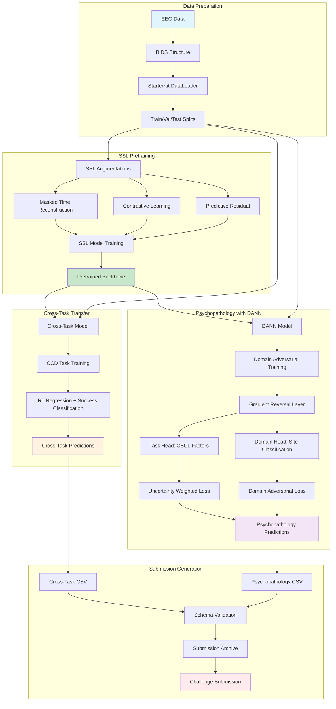
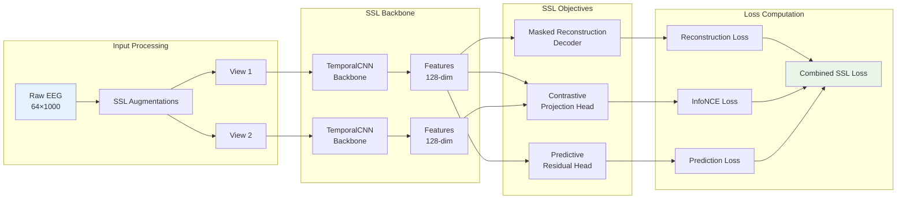
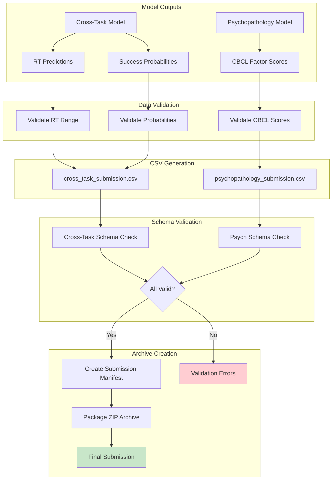
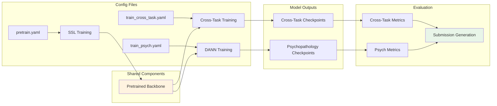
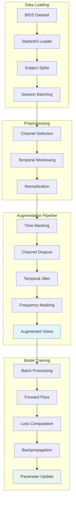
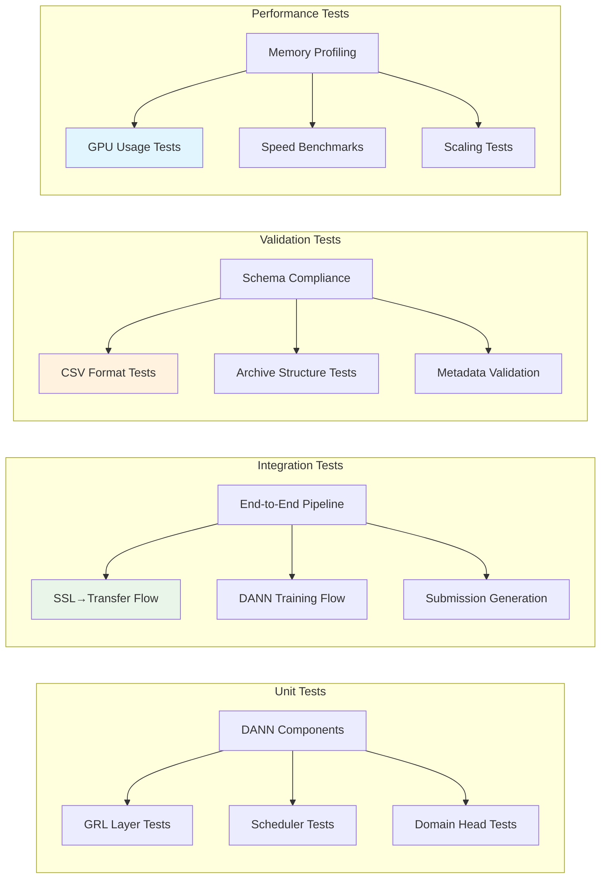
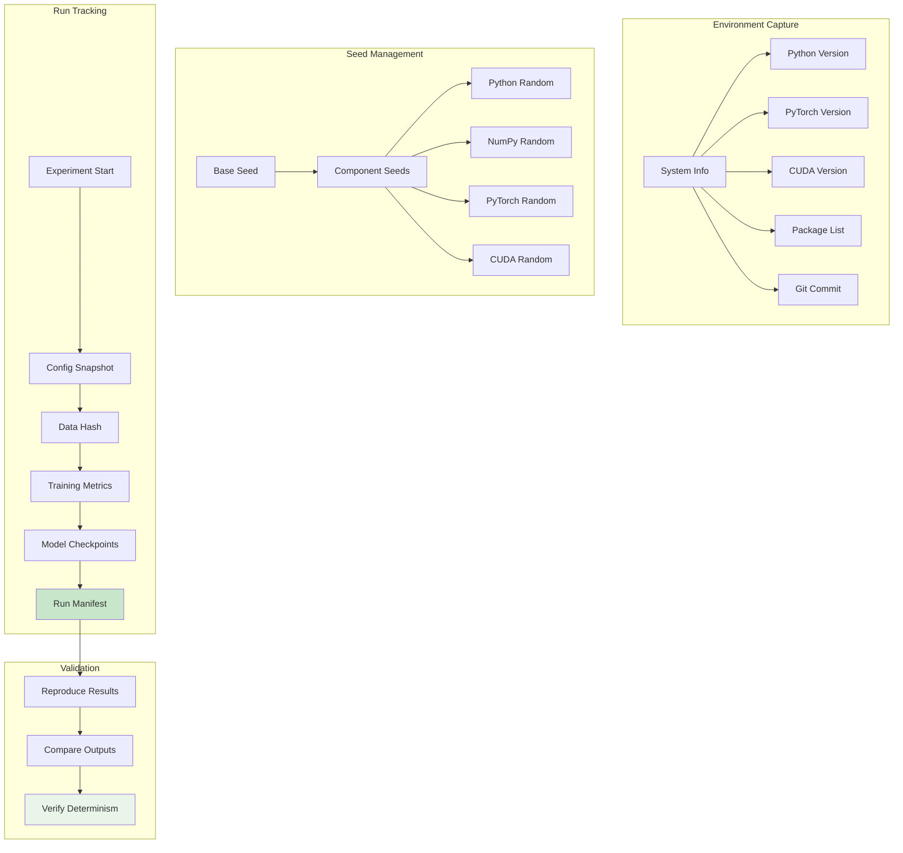

# EEG2025 Challenge Pipeline Diagrams

## Complete Training and Submission Pipeline



## SSL Pretraining Architecture



## DANN Domain Adversarial Training

```mermaid
graph TB
    subgraph "Input"
        A[EEG Data<br/>Multiple Sites] --> B[Backbone Network]
    end

    subgraph "Feature Extraction"
        B --> C[Shared Features<br/>F(x)]
    end

    subgraph "Task Branch"
        C --> D[Task Predictor<br/>Gₜ(F(x))]
        D --> E[CBCL Factors<br/>p_factor, int, ext, att]
    end

    subgraph "Domain Branch"
        C --> F[Gradient Reversal<br/>Layer (λ schedule)]
        F --> G[Domain Classifier<br/>Gd(F(x))]
        G --> H[Site Predictions]
    end

    subgraph "Loss Components"
        E --> I[Task Loss<br/>Uncertainty Weighted]
        H --> J[Domain Loss<br/>Cross-Entropy]
        I --> K[Total Loss]
        J --> K
    end

    subgraph "Lambda Scheduling"
        L[Training Step] --> M[GRL Scheduler<br/>λ: 0→0.2]
        M --> F
    end

    style C fill:#fff3e0
    style F fill:#ffebee
    style K fill:#e8f5e8
```

## Uncertainty Weighted Multi-Task Learning

```mermaid
graph LR
    subgraph "Task Predictions"
        A[Shared Features] --> B[p_factor Head]
        A --> C[Internalizing Head]
        A --> D[Externalizing Head]
        A --> E[Attention Head]
    end

    subgraph "Uncertainty Parameters"
        F[log σ₁²] --> G[σ₁² = exp(log σ₁²)]
        H[log σ₂²] --> I[σ₂² = exp(log σ₂²)]
        J[log σ₃²] --> K[σ₃² = exp(log σ₃²)]
        L[log σ₄²] --> M[σ₄² = exp(log σ₄²)]
    end

    subgraph "Weighted Loss"
        B --> N[L₁/(2σ₁²) + log σ₁]
        C --> O[L₂/(2σ₂²) + log σ₂]
        D --> P[L₃/(2σ₃²) + log σ₃]
        E --> Q[L₄/(2σ₄²) + log σ₄]

        N --> R[Combined Loss]
        O --> R
        P --> R
        Q --> R
    end

    style G fill:#e1f5fe
    style R fill:#e8f5e8
```

## Submission Pipeline Flow



## Configuration Flow



## GRL Lambda Scheduling Strategies

```mermaid
graph TB
    subgraph "Linear Warmup"
        A[Step 0<br/>λ = 0.0] --> B[Step 500<br/>λ = 0.1]
        B --> C[Step 1000<br/>λ = 0.2]
        C --> D[Step 1000+<br/>λ = 0.2]
    end

    subgraph "Exponential Decay"
        E[λ(t) = λ_final × (1 - exp(-γt))]
        E --> F[Smooth Exponential Curve]
    end

    subgraph "Cosine Annealing"
        G[Warmup Phase<br/>Linear 0→λ_max]
        G --> H[Cosine Decay<br/>λ_max→λ_min]
    end

    subgraph "Adaptive"
        I[Domain Accuracy] --> J{High Accuracy?}
        J -->|Yes| K[Increase λ]
        J -->|No| L[Decrease λ]
        K --> M[Update λ]
        L --> M
    end

    style C fill:#c8e6c9
    style M fill:#fff3e0
```

## Data Flow Architecture



## Testing Architecture



## Reproducibility Pipeline



This comprehensive set of diagrams visualizes the complete EEG2025 challenge pipeline from data loading through final submission, including all major components like SSL pretraining, DANN domain adaptation, and submission validation.
